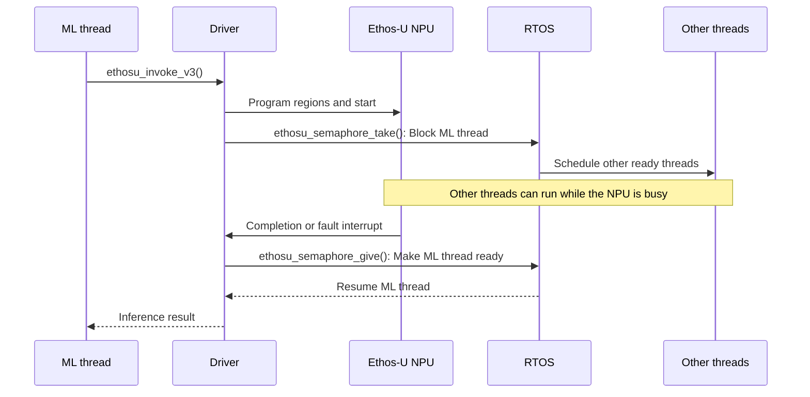
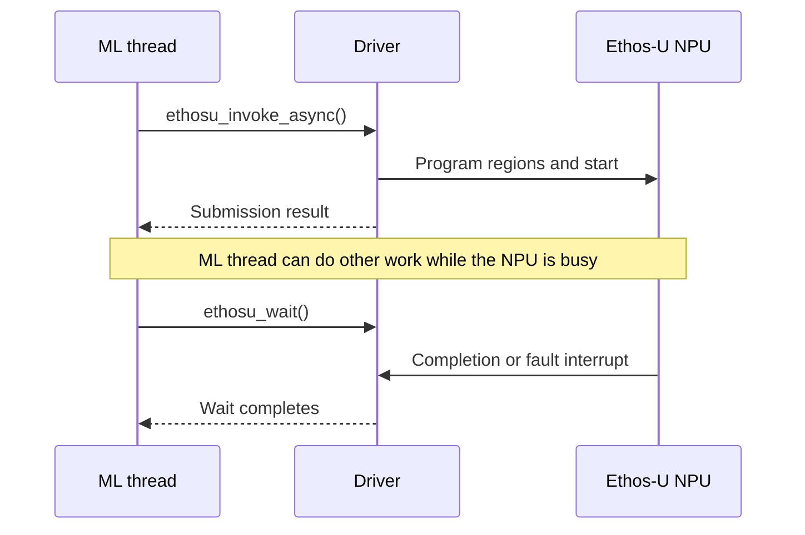

# Driver

This chapter is the technical reference for the Ethos-U driver interface.

The Ethos-U driver operations and features at a glance:

- Initializes one driver instance for each NPU;
- Programs the command-stream and model-region base addresses;
- Starts the NPU and handles completion or fault interrupts;
- Supports synchronous and asynchronous invocation;
- Provides access to the Ethos-U Performance Monitoring Unit (PMU);
- Exposes weak [platform-specific functions](group__ethosu__callback__api.html) for
  power, cache, address, and RTOS integration.

The input to the Ethos-U driver must provide:

- An optimized model generated by Vela, including the NPU command stream.
- An allocated ML framework tensor arena containing the model's input, output,
  and working memory.
- The base addresses and sizes of the memory regions referenced by the command
  stream.

The driver does not compile models, allocate the ML framework's tensor arena,
choose a memory mode in `vela.ini`, or place sections in physical memory.

## Ethos-U driver source code

The driver is provided by the software pack `ARM::Ethos-U` and can be added to a CMSIS-based application as a software component.
The pack also includes CMSIS-RTOS2 and cache-management interfaces as optional source templates.

The [CMSIS-Ethos-U GitHub repository](https://github.com/ARM-software/CMSIS-Ethos-U) provides access to the source code for other build environments.

| File or directory | Content |
| --- | --- |
| `config/` | Configurable headers for the Generic U55, U65, and U85 component variants. |
| `include/` | Public driver, data-type, and PMU header files. |
| `src/` | Common driver and PMU implementations, NPU-specific device implementations, and private headers. |
| `zephyr/` | Metadata for using the driver as a Zephyr module. |
| `CMakeLists.txt` | Build description for integrating or building the driver with CMake. |
| `README.md` | Standalone build instructions and driver API examples. |
| `LICENSE.txt`, `SECURITY.md` | License and security information for the driver source. |

### CMSIS Software component

The pack `Arm::CMSIS-Ethos-U` provides the software component `ARM::Machine Learning:NPU Support:Ethos-U Driver` in multiple variants. For using the driver add one variant of the component as shown below:

```yaml
components:
  - component: "ARM::Machine Learning:NPU Support:Ethos-U Driver&Generic U55" # For Ethos-U55
```

```yaml
components:
  - component: "ARM::Machine Learning:NPU Support:Ethos-U Driver&Generic U65" # For Ethos-U65
```

```yaml
components:
  - component: "ARM::Machine Learning:NPU Support:Ethos-U Driver&Generic U85" # For Ethos-U85
```

## Driver API

The driver API is defined in `include/ethosu_driver.h` with related types
in `include/ethosu_types.h`.

## API functions

| API Function | Description |
| --- | --- |
| \ref ethosu_init "ethosu_init()", \ref ethosu_deinit "ethosu_deinit()" | initialize or remove an NPU instance |
| \ref ethosu_invoke_v3 "ethosu_invoke_v3()" | invoke and wait synchronously |
| \ref ethosu_invoke_async "ethosu_invoke_async()", \ref ethosu_wait "ethosu_wait()" | submit asynchronously and poll or block |
| \ref ethosu_irq_handler "ethosu_irq_handler()" | handle the target interrupt |
| \ref ethosu_get_driver_version "ethosu_get_driver_version()", \ref ethosu_get_hw_info "ethosu_get_hw_info()" | inspect driver and hardware versions |
| \ref ethosu_soft_reset "ethosu_soft_reset()" | recover the NPU from an error |
| \ref ethosu_request_power "ethosu_request_power()", \ref ethosu_release_power "ethosu_release_power()" | manage power lifetime |
| \ref ethosu_reserve_driver "ethosu_reserve_driver()", \ref ethosu_release_driver "ethosu_release_driver()" | reserve an instance in a multi-NPU system |

See [Driver functions](group__ethosu__public__api.html) for the complete generated API
and [Driver structures](group__ethosu__driver__structs.html) for public data types.

## Platform-specific functions

The driver provides default implementations for
[platform-specific functions](group__ethosu__callback__api.html) listed below. The
default weak function implementation of the driver should be carefully review
and overwritten when needed.

| API Function | When an overwrite is needed |
| --- | --- |
| \ref ethosu_flush_dcache "ethosu_flush_dcache()", \ref ethosu_invalidate_dcache "ethosu_invalidate_dcache()" | CPU-cached memory is shared with the NPU and requires [platform-specific cache maintenance](#data-caching). |
| \ref ethosu_address_remap "ethosu_address_remap()" | The CPU and NPU use different addresses for the same storage. |
| \ref ethosu_config_select "ethosu_config_select()" | Memory-region attributes depend on the address or run-time placement. |
| Mutex and semaphore functions in [Platform-specific functions](group__ethosu__callback__api.html) | Multiple tasks or NPUs can use the driver and require [platform-specific RTOS locking](#mutex-and-semaphores). |
| \ref ethosu_inference_begin "ethosu_inference_begin()", \ref ethosu_inference_end "ethosu_inference_end()" | [Inference tracing, power control, or application callbacks are required](#beginend-inference-callbacks). |

Cache policy, linker placement, and region configuration are system-level 
decisions. Detailed guidance is in the chapter [Integration](../integration/index.html).

## Driver Usage

Inferences can be invoked in two manners:
synchronously or asynchronously. The two types of invocation can be freely mixed
in a single application.

### Synchronous invocation

A typical usage of the driver can be the following:

```c
// reserve a driver to be used (this call could block until a driver is available)
struct ethosu_driver *drv = ethosu_reserve_driver();
// ...
// run one or more inferences
int result = ethosu_invoke_v3(drv,
                              custom_data_ptr,
                              custom_data_size,
                              base_addr,
                              base_addr_size,
                              num_base_addr);
// ...
// release the driver for others to use
ethosu_release_driver(drv);
```

The following simplified sequence diagram shows the synchronous invocation in
an RTOS environment:



With an RTOS implementation, \ref ethosu_semaphore_take
"ethosu_semaphore_take()" blocks the calling task and allows the RTOS scheduler to
run other ready threads while the Ethos-U NPU executes the inference. The
Ethos-U interrupt handler calls \ref ethosu_semaphore_give
"ethosu_semaphore_give()" when the NPU completes or reports a
fault, allowing the synchronous invocation to resume. The platform must provide
the RTOS-specific semaphore functions described in
[Mutex and semaphores](#mutex-and-semaphores).

### Asynchronous invocation

A typical usage of the driver can be the following:

```c
// reserve a driver to be used (this call could block until a driver is available)
struct ethosu_driver *drv = ethosu_reserve_driver();
// ...
// run one or more inferences
int result = ethosu_invoke_async(drv,
                                 custom_data_ptr,
                                 custom_data_size,
                                 base_addr,
                                 base_addr_size,
                                 num_base_addr,
                                 user_arg);
// ...
// do some other work
// ...
int ret;
do {
    // true = blocking, false = non-blocking
    // ret > 0 means inference not completed (only for non-blocking mode)
    ret = ethosu_wait(drv, <true|false>);
} while(ret > 0);
// ...
// release the driver for others to use
ethosu_release_driver(drv);
```

Note that if \ref ethosu_wait "ethosu_wait()" is invoked from a different thread
and concurrently with \ref ethosu_invoke_async "ethosu_invoke_async()", the user
is responsible to guarantee that \ref ethosu_wait "ethosu_wait()" is called after
a successful completion of \ref ethosu_invoke_async "ethosu_invoke_async()".
Otherwise \ref ethosu_wait "ethosu_wait()" might fail and not actually wait for
the inference completion.

The following simplified sequence diagram shows the asynchronous invocation:



### Driver initialization

Initialize each driver instance with \ref ethosu_init "ethosu_init()". This
registers the instance and makes it available for running inference. Call
\ref ethosu_deinit "ethosu_deinit()" to unregister and tear down the instance.

Create one driver instance for each NPU device. All registered NPUs must use the
same compile-time NPU configuration because a driver build supports only one
configuration.

## Implementation design

The driver is structured in two main parts: the driver, which is responsible to
provide an unified API to the user; and the device part, which deals with the
details at the hardware level.

In order to do its task the driver needs a device implementation. There could be
multiple device implementation for different hardware model and/or
configurations. Note that the driver can be compiled to target only one NPU
configuration by specializing the device part at compile time.
?? ToDo: how

## Data caching

For running the driver on Arm CPUs which are configured with data cache, certain
caution must be taken to ensure cache coherency. The driver expects that cache
clean/flush has been done by the user application before being invoked. The
driver does provide a deprecated weakly linked function
\ref ethosu_flush_dcache "ethosu_flush_dcache()" that could be overriden, causing
the driver to cache flush/clean base pointers before each inference.

The driver also exposes a weakly linked symbol for cache invalidation called
\ref ethosu_invalidate_dcache "ethosu_invalidate_dcache()", that must be overriden
when the data cache is used. After an inference completes on the NPU, the driver
will call this function to invalidate the data cache, to ensure cache coherency.

Make sure that any base pointers used for flush/invalidation is aligned to the
cache line size of your CPU, typically 32 bytes. Due to the uncertainty of
tensor alignment, the driver only flushes/invalidates on base pointer level.

A simple example implementation for the weak functions, using CMSIS primitives
could look like below:

```cpp
void ethosu_flush_dcache(const uint64_t *base_addr, const size_t *base_addr_size, int num_base_addr)
{
    for (int i = 0; i < num_base_addr; i++)
        SCB_CleanDCache_by_Addr((uint32_t *)(uintptr_t)base_addr[i], base_addr_size[i]);
}

void ethosu_invalidate_dcache(const uint64_t *base_addr, const size_t *base_addr_size, int num_base_addr)
{
    for (int i = 0; i < num_base_addr; i++)
        SCB_InvalidateDCache_by_Addr((uint32_t *)(uintptr_t)base_addr[i], base_addr_size[i]);
}
```

The NPU contain memory attributes that should be set to match the settings used
in the MPU configuration for the memories used. See `NPU_MEM_ATTR_[0-3]` for
Ethos-U85 and the `AXI_LIMIT[0-3]_MEM_TYPE` for Ethos-U55/Ethos-U65 in
corresponding `src/ethosu_config_uX5.h` files.

## Mutex and semaphores

To ensure the correct functionality of the driver mutexes and semaphores are
used internally. The default implementations of mutexes and semaphores are
designed for a single-threaded baremetal environment. Hence for integration in
environemnts where multi-threading is possible, e.g., RTOS, the user is
responsible to provide implementation for mutexes and semaphores to be used by
the driver.

The mutex and semaphores are used as synchronisation mechanisms and unless
specified, the timeout is required to be 'forever'.

ToDo: remove references to CMake, review RTOS interface

The driver allows for an RTOS to set a timeout for the NPU interrupt semaphore.
The timeout can be set with the CMake variable `ETHOSU_INFERENCE_TIMEOUT`, which
is then used as `timeout` argument for the interrupt semaphore take call. Note
that the unit is implementation defined, the value is shipped as is to the
\ref ethosu_semaphore_take "ethosu_semaphore_take()" function and an override
implementation should cast it to the appropriate type and/or convert it to the
unit desired.

A macro `ETHOSU_SEMAPHORE_WAIT_FOREVER` is defined in the driver header file,
and should be made sure to map to the RTOS' equivalent of
'no timeout/wait forever'. Inference timeout value defaults to this if left
unset. The macro is used internally in the driver for the available NPU's, thus
the driver does NOT support setting a timeout other than forever when waiting
for an NPU to become available (global ethosu_semaphore).

The mutex and semaphore APIs are defined as weak linked functions that can be
overridden by the user. The APIs are the usual ones and described below:

```c
// create a mutex by returning back a handle
void *ethosu_mutex_create(void);
// lock the given mutex
int ethosu_mutex_lock(void *mutex);
// unlock the given mutex
int ethosu_mutex_unlock(void *mutex);

// create a (binary) semaphore by returning back a handle
void *ethosu_semaphore_create(void);
// take from the given semaphore, accepting a timeout (unit impl. defined)
int ethosu_semaphore_take(void *sem, uint64_t timeout);
// give from the given semaphore
int ethosu_semaphore_give(void *sem);
```

## Begin/End inference callbacks

The driver provide weak linked functions as hooks to receive callbacks whenever
an inference begins and ends. The user can override such functions when needed.
To avoid memory leaks, any allocations done in
\ref ethosu_inference_begin "ethosu_inference_begin()" must be balanced by a
corresponding free of the memory in
\ref ethosu_inference_end "ethosu_inference_end()" callback.

The end callback will always be called if the begin callback has been called,
including in the event of an interrupt semaphore take timeout.

```c
void ethosu_inference_begin(struct ethosu_driver *drv, void *user_arg);
void ethosu_inference_end(struct ethosu_driver *drv, void *user_arg);
```

Note that the `void *user_arg` pointer passed to
\ref ethosu_invoke_v3 "ethosu_invoke_v3()" or
\ref ethosu_invoke_async "ethosu_invoke_async()" is the same pointer passed to
the \ref ethosu_inference_begin "ethosu_inference_begin()" and
\ref ethosu_inference_end "ethosu_inference_end()" callbacks. For example:

```c
void my_function() {
    // ...
    struct my_data data = {...};
    int result = ethosu_invoke_v3(drv,
                                  custom_data_ptr,
                                  custom_data_size,
                                  base_addr,
                                  base_addr_size,
                                  num_base_addr,
                                  (void *)&data);
    // ...
}

void ethosu_inference_begin(struct ethosu_driver *drv, void *user_arg) {
        struct my_data *data = (struct my_data*) user_arg;
        // use drv and data here
}

void ethosu_inference_end(struct ethosu_driver *drv, void *user_arg) {
        struct my_data *data = (struct my_data*) user_arg;
        // use drv and data here
}
```

For a practical use of these callbacks, see the [PMU example](#pmu-example).

## Driver Configuration

The selected driver component supplies a target-specific configuration file:

| Driver variant | Configuration file    |
|:---------------|:----------------------|
| Generic U55    | `ethosu_config_u55.h` |
| Generic U65    | `ethosu_config_u65.h` |
| Generic U85    | `ethosu_config_u85.h` |

For CMSIS based projects, the configuration header file is copied to the RTE directory from the pack locally to the project where one may
modify the configuration defines. Each configuration define provides annotations
for CMSIS Configuration Wizard and is guarded by `#ifndef`, so it may be changed
on solution level as well.

The headers configure how the driver programs the NPU.

### Configuration Options

#### Command-stream and base-pointer routing

All three driver variants use the define `NPU_QCONFIG` and `NPU_REGIONCFG_0` to `NPU_REGIONCFG_7`,
but the selected value has target-specific meaning:

| Define               | Configures Access     |
| -------------------- | --------------------- |
| `NPU_QCONFIG`        | command-stream        |
| `NPU_REGIONCFG_0..7` | constants/arena/cache |

On Ethos-U55 and Ethos-U65, the (?todo which value) value selects an AXI port, outstanding
transaction counter, and AXI limit entry:

| Value | AXI path        | Limit entry  |
| ----- | --------------- | ------------ |
| `0`   | AXI0, counter 0 | `AXI_LIMIT0` |
| `1`   | AXI0, counter 1 | `AXI_LIMIT1` |
| `2`   | AXI1, counter 2 | `AXI_LIMIT2` |
| `3`   | AXI1, counter 3 | `AXI_LIMIT3` |

On Ethos-U85, the value selects `MEM_ATTR0..3` which then specifies the AXI port,
memory domain, and memory type.

### Ethos-U85 memory attributes

Ethos-U85 provides four memory-attribute entries configured by `NPU_MEM_ATTR_0..3`.
Each option is an encoded byte:

| Bits    | Field         | Values                                                                      |
| ------- | ------------- | --------------------------------------------------------------------------- |
| `[1:0]` | memory domain | `0`: non-shareable; `1`: inner shareable; `2`: outer shareable; `3`: system |
| `[2]`   | AXI port      | `0`: SRAM; `1`: EXT                                                         |
| `[3]`   | reserved      | keep clear                                                                  |
| `[7:4]` | memory type   | AXI read and write cache-attribute encoding                                 |

`NPU_QCONFIG` and each `NPU_REGIONCFG_x` select one of these entries. Therefore,
changing a `NPU_MEM_ATTR_x` option changes every command-stream or base-pointer
access routed to that entry.

## Logging

The driver logging interface is implemented by the private header
`source/src/ethosu_log.h`. It is a compile-time facility used by the driver and
device implementation, rather than a runtime callback API. See
\ref ethosu_log_api "Logging" for the generated macro reference. The header
provides the following `printf`-style macros:

| Macro | Output |
| --- | --- |
| `LOG()` | An unprefixed message on `stdout`; no newline is added automatically. |
| `LOG_ERR()` | An error on `stderr`, prefixed with `E:` and the source file and line. |
| `LOG_WARN()` | A warning on `stdout`, prefixed with `W:`. |
| `LOG_INFO()` | An informational message on `stdout`, prefixed with `I:`. |
| `LOG_DEBUG()` | A debug message on `stdout`, prefixed with `D:` and the function name. |

`ETHOSU_LOG_ENABLE` enables or disables all driver logging and defaults to `1`.
`ETHOSU_LOG_SEVERITY` selects the most verbose severity that is compiled in:
`ETHOSU_LOG_ERR`, `ETHOSU_LOG_WARN`, `ETHOSU_LOG_INFO`, or
`ETHOSU_LOG_DEBUG`. The default is `ETHOSU_LOG_WARN`, which includes error and
warning messages. `LOG()` is not filtered by severity, but is disabled by
`ETHOSU_LOG_ENABLE`.

The macros write through the C library `stdout` and `stderr` streams. An embedded
target must therefore retarget these streams to an available output, such as a
UART, semihosting, or an ITM channel. If no output is required, disable logging
to avoid pulling the formatted I/O implementation into the application.

For a CMake build, enable debug-level logging as follows:

```bash
cmake -S source -B build \
    -DETHOSU_LOG_ENABLE=ON \
    -DETHOSU_LOG_SEVERITY=debug
```

The accepted CMake severity values are `err`, `warning`, `info`, and `debug`.
For other build systems, define the equivalent macros while compiling the driver
sources, for example:

```text
ETHOSU_LOG_ENABLE=1
ETHOSU_LOG_SEVERITY=ETHOSU_LOG_INFO
```

## Performance Monitoring Unit (PMU)

The driver exposes the Ethos-U PMU through `pmu_ethosu.h`. The API supports a
64-bit cycle counter and programmable event counters. Ethos-U55 and Ethos-U65
builds provide four event counters; Ethos-U85 builds provide eight. Use
\ref ETHOSU_PMU_Get_NumEventCounters "ETHOSU_PMU_Get_NumEventCounters()" when
code must work with more than one Ethos-U target.

The target-specific `enum ethosu_pmu_event_type` lists the supported events.
They include NPU and MAC activity or stalls, weight-decoder and activation-output
activity, memory transactions and stalls, latency ranges, and ECC events. The
available event names differ between Ethos-U55/U65 and Ethos-U85. Use the
symbolic enum values with
\ref ETHOSU_PMU_Set_EVTYPER "ETHOSU_PMU_Set_EVTYPER()"; do not program hardware
event numbers directly.

The main API groups are:

| API Function | Description |
|---|---|
| \ref ETHOSU_PMU_Enable "ETHOSU_PMU_Enable()", \ref ETHOSU_PMU_Disable "ETHOSU_PMU_Disable()" | Enable or disable the PMU |
| \ref ETHOSU_PMU_Set_EVTYPER "ETHOSU_PMU_Set_EVTYPER()", \ref ETHOSU_PMU_Get_EVTYPER "ETHOSU_PMU_Get_EVTYPER()" | Select an event |
| \ref ETHOSU_PMU_CYCCNT_Reset "ETHOSU_PMU_CYCCNT_Reset()", \ref ETHOSU_PMU_EVCNTR_ALL_Reset "ETHOSU_PMU_EVCNTR_ALL_Reset()" | Reset counters |
| \ref ETHOSU_PMU_CNTR_Enable "ETHOSU_PMU_CNTR_Enable()", \ref ETHOSU_PMU_CNTR_Disable "ETHOSU_PMU_CNTR_Disable()" | Enable or disable counters |
| \ref ETHOSU_PMU_Get_CCNTR "ETHOSU_PMU_Get_CCNTR()", \ref ETHOSU_PMU_Get_EVCNTR "ETHOSU_PMU_Get_EVCNTR()" | Read counters |
| \ref ETHOSU_PMU_Get_CNTR_OVS "ETHOSU_PMU_Get_CNTR_OVS()", \ref ETHOSU_PMU_Set_CNTR_OVS "ETHOSU_PMU_Set_CNTR_OVS()", \ref ETHOSU_PMU_Set_CNTR_IRQ_Enable "ETHOSU_PMU_Set_CNTR_IRQ_Enable()", \ref ETHOSU_PMU_Set_CNTR_IRQ_Disable "ETHOSU_PMU_Set_CNTR_IRQ_Disable()" | Handle overflow |

Counter masks use `ETHOSU_PMU_CNT1_Msk` and the other event-counter masks, plus
`ETHOSU_PMU_CCNT_Msk` for the cycle counter. Enabling the PMU requests NPU power;
disabling it releases that request, so always pair the two operations.

Override \ref ethosu_inference_begin "ethosu_inference_begin()" to select and
reset events immediately before an inference, and override
\ref ethosu_inference_end "ethosu_inference_end()" to read the counters and
disable the PMU afterward. These callbacks receive the same `user_arg` that was
passed to \ref ethosu_invoke_v3 "ethosu_invoke_v3()" or
\ref ethosu_invoke_async "ethosu_invoke_async()", which can identify where the
results should be stored. PMU measurements are hardware observations; compare
them with Vela compiler estimates, but do not treat the estimates as
cycle-accurate measurements.

### Interpreting PMU events

The Technical Reference Manual for each NPU provides the event encoding and a hardware-level description of what each event counts:

- [Ethos-U55 TRM: `PMU_EVTYPER0..3`](https://support.arm.com/documentation/102420/latest/Programmers-model/Register-page-PMU/PMU-EVTYPER0-----PMU-EVTYPER3) (Table 4-81 in PDF version).
- [Ethos-U65 TRM: `PMU_EVTYPER0..3`](https://support.arm.com/documentation/102023/latest/Programmers-model/Register-page-PMU/PMU-EVTYPER0-----PMU-EVTYPER3) (Table 4-79 in PDF version)
- [Ethos-U85 TRM: PMU_COUNTERS register summary](https://support.arm.com/documentation/102685/latest/Programmers-model/Register-sets-for-NPU-control/PMU-COUNTERS-register-summary) - `PMEVTYPER0..7` and the `EV_TYPE` tables.

Use the event descriptions together with the following guidelines:

- `ETHOSU_PMU_NPU_ACTIVE` counts cycles in which the NPU is running, while
  `ETHOSU_PMU_NPU_IDLE` counts cycles in which it is stopped. Use these events or
  the dedicated cycle counter as the baseline when comparing inferences.
- MAC, activation-output (AO), and weight-decoder (WD) activity events show when
  the corresponding engine is doing useful work. A high stall count relative to
  its activity count points to the resource named by the stall event as a likely
  bottleneck.
- Memory transaction events count accepted or completed requests. Data-beat
  events measure transferred data, and stall events show backpressure from the
  memory system or a configured outstanding-transaction limit.
- Latency events count transactions whose latency reaches the named threshold.
  Compare the threshold counts with the total-transaction event to determine how
  much traffic experiences long latency.
- ECC events indicate corrected or uncorrected memory errors and should normally
  remain zero.

Event counters are 32-bit and can overflow during a long measurement. Check
\ref ETHOSU_PMU_Get_CNTR_OVS "ETHOSU_PMU_Get_CNTR_OVS()" when this is possible.
Because only four or eight events can be measured at once, collect additional
events in repeated runs with identical model, input, memory, and system settings.

### PMU example

The following example counts NPU-active and NPU-idle events and records the NPU
cycle count for one inference. Pass a pointer to `struct pmu_results` as the
`user_arg` to \ref ethosu_invoke_v3 "ethosu_invoke_v3()" or
\ref ethosu_invoke_async "ethosu_invoke_async()". The callbacks use
\ref ETHOSU_PMU_Get_NumEventCounters "ETHOSU_PMU_Get_NumEventCounters()" so the
same pattern can be extended with additional events on targets that provide more
counters.

```c
#include "ethosu_driver.h"
#include "pmu_ethosu.h"

#define PMU_EXAMPLE_EVENT_COUNT 2U

static const enum ethosu_pmu_event_type pmu_events[PMU_EXAMPLE_EVENT_COUNT] = {
    ETHOSU_PMU_NPU_ACTIVE,
    ETHOSU_PMU_NPU_IDLE,
};

struct pmu_results {
    uint64_t cycle_count;
    uint32_t event_count[PMU_EXAMPLE_EVENT_COUNT];
    uint32_t num_events;
};

void ethosu_inference_begin(struct ethosu_driver *drv, void *user_arg)
{
    struct pmu_results *results = (struct pmu_results *)user_arg;
    uint32_t num_events = ETHOSU_PMU_Get_NumEventCounters();

    if (num_events > PMU_EXAMPLE_EVENT_COUNT) {
        num_events = PMU_EXAMPLE_EVENT_COUNT;
    }
    results->num_events = num_events;

    ETHOSU_PMU_Enable(drv);
    ETHOSU_PMU_CYCCNT_Reset(drv);
    ETHOSU_PMU_EVCNTR_ALL_Reset(drv);

    for (uint32_t i = 0; i < num_events; ++i) {
        ETHOSU_PMU_Set_EVTYPER(drv, i, pmu_events[i]);
        ETHOSU_PMU_CNTR_Enable(drv, 1UL << i);
    }

    ETHOSU_PMU_PMCCNTR_CFG_Set_Start_Event(drv, ETHOSU_PMU_NPU_ACTIVE);
    ETHOSU_PMU_PMCCNTR_CFG_Set_Stop_Event(drv, ETHOSU_PMU_NPU_IDLE);
    ETHOSU_PMU_CNTR_Enable(drv, ETHOSU_PMU_CCNT_Msk);
}

void ethosu_inference_end(struct ethosu_driver *drv, void *user_arg)
{
    struct pmu_results *results = (struct pmu_results *)user_arg;

    results->cycle_count = ETHOSU_PMU_Get_CCNTR(drv);
    for (uint32_t i = 0; i < results->num_events; ++i) {
        results->event_count[i] = ETHOSU_PMU_Get_EVCNTR(drv, i);
    }

    ETHOSU_PMU_Disable(drv);
}
```

ToDo: does CMSIS-Debugger offer a dialog for Ethos_PMU?

## Bring-up checklist

- Confirm the NPU identity and MAC configuration match the Vela compiler target.
- Confirm the command stream and every used base region are NPU-accessible.
- Wire the interrupt to \ref ethosu_irq_handler "ethosu_irq_handler()" and
  exercise a timeout path.
- Verify cache clean/invalidate behavior with caches enabled, not only disabled.
- Check address remapping for TCM or aliased memory windows.
- Start with one known-good, fully supported model before testing a large graph.
- Use PMU cycle, activity, stall, and memory events when validating performance
  or investigating a difference from compiler estimates.
- Capture driver fault information before resetting after an error.

Continue with the end-to-end [Integration](../integration/index.html) checklist
before treating driver bring-up as complete.
