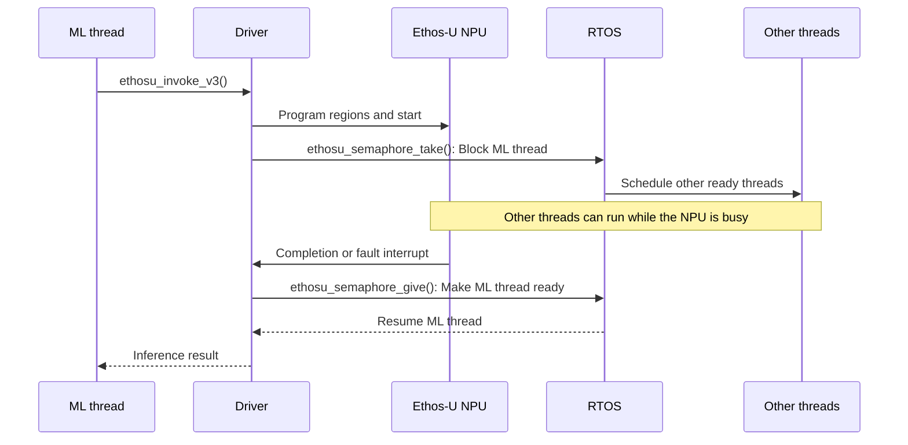
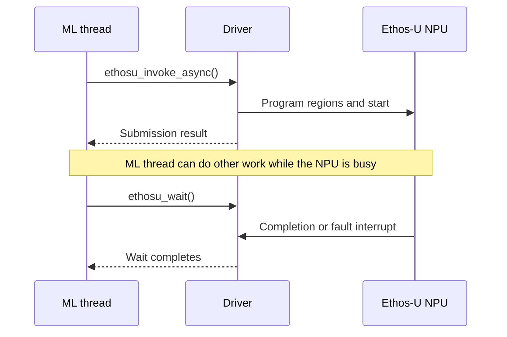

# Driver

This chapter is the technical reference for the Ethos-U driver interface.

The Ethos-U driver operations and features at a glance:

- Initializes one driver instance for each NPU;
- Programs the command-stream and model-region base addresses;
- Starts the NPU and handles completion or fault interrupts;
- Supports synchronous and asynchronous invocation;
- Provides access to the Ethos-U Performance Monitoring Unit (PMU);
- Exposes weak [platform-specific functions](group__ethosu__callback__api.html) for
  power, cache, address, and RTOS integration.

The input to the Ethos-U driver must provide:

- An optimized model generated by Vela, including the NPU command stream.
- An allocated ML framework tensor arena containing the model's input, output,
  and working memory.
- The base addresses and sizes of the memory regions referenced by the command
  stream.

The driver does not compile models, allocate the ML framework's tensor arena,
choose a memory mode in `vela.ini`, or place sections in physical memory.

For the first execution on a target, follow the
<a href="#driver-bring-up-checklist">Driver bring-up checklist</a>.

## Ethos-U driver source code

The driver source is maintained in the
[Ethos-U core-driver repository](https://gitlab.arm.com/artificial-intelligence/ethos-u/ethos-u-core-driver).
The software pack `ARM::CMSIS-Ethos-U` includes this source code unchanged and
makes it available to CMSIS-based applications as a software component. The
same source can therefore be obtained directly from the repository for use with
other build environments. The pack also includes CMSIS-RTOS2, FreeRTOS and
cache-management interfaces as optional source code templates.

| File or directory | Content |
| --- | --- |
| `include/` | Public driver, device, data-type, and PMU header files. |
| `src/` | Common driver code, variant-specific backend and PMU implementations, default configuration headers, register interfaces, and private headers. |
| `zephyr/` | Metadata for using the driver as a Zephyr module. |
| `CMakeLists.txt` | Build description for integrating or building the driver with CMake. |
| `README.md` | Standalone build instructions and driver API examples. |
| `LICENSE.txt`, `SECURITY.md` | License and security information for the driver source. |

### CMSIS Software component

The pack `ARM::CMSIS-Ethos-U` provides the software component `ARM::Machine Learning:NPU Support:Ethos-U Driver` in multiple variants. For using the driver add one variant of the component as shown below:

```yaml
components:
  - component: "ARM::Machine Learning:NPU Support:Ethos-U Driver&Generic U55" # For Ethos-U55
```

```yaml
components:
  - component: "ARM::Machine Learning:NPU Support:Ethos-U Driver&Generic U65" # For Ethos-U65
```

```yaml
components:
  - component: "ARM::Machine Learning:NPU Support:Ethos-U Driver&Generic U85" # For Ethos-U85
```

## Compile-time configuration

The Ethos-U driver is configured with preprocessor `#define` statements. The following tables
list the supported configuration statements.

### Single-variant build

A single-variant build supports one Ethos-U variant selected at compile time.
Define exactly one Ethos-U family together with its MAC configuration. Do not
define `ETHOSU_MULTI_VARIANT`.

| `#define` | Purpose |
| --- | --- |
| `ETHOSU55`, `ETHOSU65`, or `ETHOSU85` | Select the Ethos-U family. Define exactly one. |
| `ETHOSU_MACS` | Select the MAC configuration, for example `128` for an Ethos-U55-128 variant. |

### Multi-variant build

A multi-variant build includes support for Ethos-U55, Ethos-U65, and Ethos-U85.
The Ethos-U variant and MAC configuration are selected for each driver instance
at run time. Do not define the single-variant `ETHOSU55`, `ETHOSU65`,
`ETHOSU85`, or `ETHOSU_MACS` statements in this build.

| `#define` | Purpose |
| --- | --- |
| `ETHOSU_MULTI_VARIANT` | Enable multi-variant support. This changes the initialization, reservation, platform-operation, and PMU APIs available to the application. |

### Common configuration

The following `#define` statements apply in either a single-variant or
multi-variant build. In a multi-variant build, the memory-routing statements
initialize the default configuration for each included Ethos-U family.

`NPU_QCONFIG` and `NPU_REGIONCFG_0` through `NPU_REGIONCFG_7` provide default
memory-access selectors; they do not contain addresses. `NPU_QCONFIG` selects
the access configuration used to fetch the command stream. The suffix in
`NPU_REGIONCFG_n` identifies the corresponding `base_addr[n]` region, while the
value selects its access configuration. On Ethos-U55 and Ethos-U65, the value
selects an `AXI_LIMITx` access profile. On Ethos-U85, it selects a `MEM_ATTR`
entry. See
[Command stream regions and base pointers](#command-stream-regions-and-base-pointers).

| `#define` | Purpose |
| --- | --- |
| `ETHOSU_MAX_WAITERS` | Set the maximum number of distinct Ethos-U variants tracked by driver reservation. The default is `4`. |
| `ETHOSU_SEMAPHORE_WAIT_INFERENCE` | Set the timeout passed to the platform semaphore while waiting for inference completion. The default is `ETHOSU_SEMAPHORE_WAIT_FOREVER`; the platform defines the time unit. See [Mutex and semaphores](#mutex-and-semaphores). |
| `NPU_QCONFIG` | Set the default memory-access selector for fetching the command stream. |
| `NPU_REGIONCFG_0` through `NPU_REGIONCFG_7` | Set the default memory-access selector for each corresponding `base_addr[0]` through `base_addr[7]` region. |

### Text logging

The following `#define` statements configure driver text logging through the C
standard I/O streams. See [Logging](#logging) for the output format and stream
requirements.

| `#define` | Purpose |
| --- | --- |
| `ETHOSU_LOG_ENABLE` | Enable or disable logging. The default is `1`. |
| `ETHOSU_LOG_SEVERITY` | Select the most verbose compiled log level: `ETHOSU_LOG_ERR`, `ETHOSU_LOG_WARN`, `ETHOSU_LOG_INFO`, or `ETHOSU_LOG_DEBUG`. The default is `ETHOSU_LOG_WARN`. |

### Variant-specific hardware configuration

The configuration headers provide default values for the following hardware
`#define` statements. A silicon vendor can supply values validated for its NPU,
interconnect, memory system, cache policy, and security configuration to adjust
the driver defaults. Do not tune these settings independently. See
[Command stream regions and base pointers](#command-stream-regions-and-base-pointers).

| Ethos-U variant | `#define` statements |
| --- | --- |
| Ethos-U55 and Ethos-U65 | `AXI_LIMITx_MAX_BEATS_BYTES`, `AXI_LIMITx_MEM_TYPE`, `AXI_LIMITx_MAX_OUTSTANDING_READS`, and `AXI_LIMITx_MAX_OUTSTANDING_WRITES`, where `x` is `0` through `3`. |
| Ethos-U85 | `NPU_MAC_PWR_RAMP_CYCLES`, `NPU_MEM_ATTR_0` through `NPU_MEM_ATTR_3`, `AXI_LIMIT_SRAM_MAX_OUTSTANDING_READ`, `AXI_LIMIT_SRAM_MAX_OUTSTANDING_WRITE`, `AXI_LIMIT_SRAM_MAX_BEATS`, `AXI_LIMIT_EXT_MAX_OUTSTANDING_READ`, `AXI_LIMIT_EXT_MAX_OUTSTANDING_WRITE`, and `AXI_LIMIT_EXT_MAX_BEATS`. |

For Ethos-U55 and Ethos-U65, each `AXI_LIMITx` register defines a complete AXI
access profile, despite the register name suggesting that it contains only
transaction limits. The corresponding `AXI_LIMITx_*` `#define` statements
configure its maximum burst size, memory type, and maximum number of
outstanding read and write transactions. In particular, `AXI_LIMITx_MEM_TYPE`
sets the memory type used to encode the AXI AxCACHE signals.

## Command stream regions and base pointers

[Vela](../vela/index.html) emits command streams that address data as offsets
within numbered memory regions. The invoke API supplies the base address of
each region in `base_addr[]`: `base_addr[0]` is used for region 0,
`base_addr[1]` for region 1, and so on. The matching field in the NPU
`REGIONCFG` register selects the access configuration for each region, including
the AXI port and memory attributes used for its transactions.

`QBASE` holds the base address of the command stream. `QCONFIG` selects the
access configuration used to fetch it, using the same selector encoding as
`REGIONCFG`.

The address and access-configuration inputs are related as follows:

| NPU access | Address programmed by the driver | Access-configuration selector | Default `#define` |
| --- | --- | --- | --- |
| Command stream | `QBASE`, from the command-stream pointer passed to the invoke API | `QCONFIG` | `NPU_QCONFIG` |
| Base-pointer region `n` | `BASEP[n]`, from `base_addr[n]` | `REGIONCFG[n]` | `NPU_REGIONCFG_n` |

The default selector values are listed under
[Ethos-U55 and Ethos-U65](#ethos-u55-and-ethos-u65) and
[Ethos-U85](#ethos-u85). An application developer can select a Vela system
configuration and memory mode supported by the target to meet the application's
requirements. The selector values must match the resulting memory placement
and memory system. See
<a href="../general/index.html#system-configuration-and-memory-modes-at-a-glance">System configuration and memory modes at a glance</a>.
In a [single-variant build](#single-variant-build), an override of
\ref ethosu_config_select "ethosu_config_select()" can replace the defaults. In
a [multi-variant build](#multi-variant-build), the values come from the device
configuration passed to \ref ethosu_init_ex "ethosu_init_ex()", or from a
per-driver `config_select` user operation.

The selected
<a href="../vela/index.html#memory-mode-parameters">Vela memory mode</a>
determines the memory areas used for constants, scratch, and optional fast
scratch. The following table shows the common mappings. The runtime base
pointers and the access configurations selected by `REGIONCFG` must match the
actual placement.

| Vela memory mode | Region 0 constants | Region 1 scratch | Region 2 fast scratch |
| --- | --- | --- | --- |
| `Sram_Only` | SRAM | SRAM | Not used |
| `Shared_Sram` | DRAM/Flash | SRAM | Not used |
| `Dedicated_Sram` | DRAM/Flash | DRAM | SRAM |

In `Dedicated_Sram` mode, Vela uses region 2 for fast scratch. The driver calls
this region `FAST_MEMORY`. The driver must know the actual fast memory address
and size through the `fast_memory` and `fast_memory_size` arguments to
\ref ethosu_init "ethosu_init()" or \ref ethosu_init_ex "ethosu_init_ex()". If
fast memory is configured and the invoke call includes base pointer 2, the
driver checks that `base_addr_size[2]` fits inside `fast_memory_size` and
rewrites `base_addr[2]` to the configured fast memory address before programming
the NPU. The driver therefore applies the fast-memory address without requiring
the framework to replace base pointer 2.

### Ethos-U55 and Ethos-U65

Ethos-U55 and Ethos-U65 provide the `AXI0` and `AXI1` access paths.

| Memory placement | AXI port |
| --- | --- |
| SRAM | `AXI0` |
| DRAM/Flash | `AXI1` |

The driver provides the following default values:

| Ethos-U variant | `NPU_QCONFIG` | `NPU_REGIONCFG_0` | `NPU_REGIONCFG_1` | `NPU_REGIONCFG_2` |
| --- | --- | --- | --- | --- |
| Ethos-U55 | `2` -> `AXI1` | `3` -> `AXI1` | `0` -> `AXI0` | `1` -> `AXI0` |
| Ethos-U65 | `2` -> `AXI1` | `3` -> `AXI1` | `0` -> `AXI0` | `1` -> `AXI0` |

For Ethos-U55 and Ethos-U65, `QCONFIG` and the `REGIONCFG[0..7]` fields accept
values 0 through 3. Each value selects both an AXI port and the complete
`AXI_LIMITx` access profile used for transactions:

| Value | AXI port | AXI access profile |
| --- | --- | --- |
| `0` | `AXI0` | `AXI_LIMIT0` |
| `1` | `AXI0` | `AXI_LIMIT1` |
| `2` | `AXI1` | `AXI_LIMIT2` |
| `3` | `AXI1` | `AXI_LIMIT3` |

Each `AXI_LIMITx` access profile contains the burst split alignment, the memory
type used to encode AxCACHE, and the maximum number of outstanding read and
write transactions. These fields are configured by
`AXI_LIMITx_MAX_BEATS_BYTES`, `AXI_LIMITx_MEM_TYPE`,
`AXI_LIMITx_MAX_OUTSTANDING_READS`, and
`AXI_LIMITx_MAX_OUTSTANDING_WRITES`, respectively.

The Ethos-U55 `AXI1` port is read-only. If region 1 contains writable scratch
data, it must not be routed through `AXI1`.

### Ethos-U85

The AXI ports are referred to as `AXI_SRAM` and `AXI_EXT`.

| Memory placement | AXI port |
| --- | --- |
| SRAM | `AXI_SRAM` |
| DRAM/Flash | `AXI_EXT` |

The driver provides the following default values:

| Ethos-U variant | `NPU_QCONFIG` | `NPU_REGIONCFG_0` | `NPU_REGIONCFG_1` | `NPU_REGIONCFG_2` |
| --- | --- | --- | --- | --- |
| Ethos-U85 | `2` -> `MEM_ATTR_2` -> `AXI_EXT` | `3` -> `MEM_ATTR_3` -> `AXI_EXT` | `0` -> `MEM_ATTR_0` -> `AXI_SRAM` | `1` -> `MEM_ATTR_1` -> `AXI_SRAM` |

For Ethos-U85, each `NPU_MEM_ATTR_n` `#define` supplies the packed value written
to the corresponding `MEM_ATTR[n]` register. The suffix `n` identifies the
entry; it is not the value assigned to the `#define`. Each entry selects the AXI
port and specifies the memory domain and the memory type used to encode the
AxCACHE signals.

`QCONFIG` and each `REGIONCFG` field contain an index from 0 through 3 that
selects one of these `MEM_ATTR` entries. The default `MEM_ATTR_0` and
`MEM_ATTR_1` entries use `AXI_SRAM`, while `MEM_ATTR_2` and `MEM_ATTR_3` use
`AXI_EXT`. For example, `NPU_QCONFIG` defaults to `2`, selecting `MEM_ATTR_2`;
the default packed value of `NPU_MEM_ATTR_2` is `(1 << 2)`, or `4`, which
selects `AXI_EXT`.

These default `MEM_ATTR` values are set by the driver to replicate the default
Ethos-U55 and Ethos-U65 behavior, making it easier to correlate configurations
across variants, but the `MEM_ATTR` values can be configured by the user.

Ethos-U85 AXI limits are configured in the `AXI_SRAM` and `AXI_EXT` registers.
There is one `AXI_SRAM` register and one `AXI_EXT` register, so those limit
settings apply to all ports in each group.

Ethos-U85 AXI information:

| U85 configuration (MACs/CC) | Number of SRAM ports | Maximum outstanding reads per port | Maximum outstanding writes per port |
| --- | --- | --- | --- |
| 128 | 2 | 12 | 16 |
| 256 | 2 | 12 | 16 |
| 512 | 2 | 12 | 16 |
| 1024 | 2 | 12 | 16 |
| 2048 | 4 | 12 | 16 |

| U85 configuration (MACs/CC) | Number of EXT ports | Maximum outstanding reads per port | Maximum outstanding writes per port |
| --- | --- | --- | --- |
| 128 | 1 | 32 | 32 |
| 256 | 1 | 32 | 32 |
| 512 | 1 | 64 | 32 |
| 1024 | 2 | 64 | 32 |
| 2048 | 2 | 64 | 32 |

## Driver API

The driver API is defined in `include/ethosu_driver.h` with related types
in `include/ethosu_types.h`.

## API functions

| API Function | Build | Description |
| --- | --- | --- |
| \ref ethosu_init "ethosu_init()" | Single-variant | Initialize and register an NPU instance using the compile-time device selection. |
| \ref ethosu_init_ex "ethosu_init_ex()" | Multi-variant | Initialize and register an NPU instance using a device descriptor, run-time configuration, and optional per-driver user operations. |
| \ref ethosu_deinit "ethosu_deinit()" | Both | Unregister an idle NPU instance and release its synchronization resources. |
| \ref ethosu_invoke_v3 "ethosu_invoke_v3()" | Both | Submit an inference to a specified driver and wait synchronously for completion. |
| \ref ethosu_invoke_async "ethosu_invoke_async()", \ref ethosu_wait "ethosu_wait()" | Both | Submit an inference asynchronously, then poll or block for completion. |
| \ref ethosu_invoke_auto "ethosu_invoke_auto()" | Multi-variant | Read the network's NPU requirements, reserve a matching driver, run the inference, and release the driver. |
| \ref ethosu_get_product_config_from_cop_data "ethosu_get_product_config_from_cop_data()" | Both | Read the Ethos-U product and MAC configuration from a Vela custom-operator payload. |
| \ref ethosu_irq_handler "ethosu_irq_handler()" | Both | Handle an NPU completion or fault interrupt for a driver instance. |
| \ref ethosu_get_driver_version "ethosu_get_driver_version()", \ref ethosu_get_hw_info "ethosu_get_hw_info()" | Both | Inspect the driver version and an NPU instance's hardware information. |
| \ref ethosu_soft_reset "ethosu_soft_reset()" | Both | Reset an NPU instance and restore its configuration. |
| \ref ethosu_request_power "ethosu_request_power()", \ref ethosu_release_power "ethosu_release_power()" | Both | Manage reference-counted NPU power requests. |
| \ref ethosu_reserve_driver "ethosu_reserve_driver()" | Single-variant | Block until an instance of the compile-time NPU variant is available and reserve it. |
| \ref ethosu_reserve_driver_ex "ethosu_reserve_driver_ex()" | Both | Block until an instance matching the requested product and MAC configuration is available and reserve it. |
| \ref ethosu_release_driver "ethosu_release_driver()" | Both | Release a reserved driver instance. |

See [Driver functions](group__ethosu__public__api.html) for the complete generated API
and [Driver structures](group__ethosu__driver__structs.html) for public data types.

## Platform-specific functions

The driver provides default implementations for
[platform-specific functions](group__ethosu__callback__api.html) listed below. The
default weak function implementation of the driver should be carefully review
and overwritten when needed.

| API Function | When an overwrite is needed |
| --- | --- |
| \ref ethosu_flush_dcache "ethosu_flush_dcache()", \ref ethosu_invalidate_dcache "ethosu_invalidate_dcache()" | CPU-cached memory is shared with the NPU and requires [platform-specific cache maintenance](#data-caching). |
| \ref ethosu_address_remap "ethosu_address_remap()" | The CPU and NPU use different addresses for the same storage. |
| \ref ethosu_config_select "ethosu_config_select()" | Memory-region attributes depend on the address or run-time placement. |
| Mutex and semaphore functions in [Platform-specific functions](group__ethosu__callback__api.html) | Multiple threads or NPUs can use the driver and require [platform-specific RTOS locking](#mutex-and-semaphores). |
| \ref ethosu_inference_begin "ethosu_inference_begin()", \ref ethosu_inference_end "ethosu_inference_end()" | [Inference tracing, power control, or application callbacks are required](#beginend-inference-callbacks). |

Cache policy, linker placement, and region configuration are system-level 
decisions. Detailed guidance is in the chapter [Integration](../integration/index.html).

## Driver Usage

Inferences can be invoked in two manners:
synchronously or asynchronously. The two types of invocation can be freely mixed
in a single application.

### Synchronous invocation

The typical usage of the driver is the synchronous invocation as shown below:

```c
// reserve a driver to be used (this call could block until a driver is available)
struct ethosu_driver *drv = ethosu_reserve_driver();
// ...
// run one or more inferences
int result = ethosu_invoke_v3(drv,
                              custom_data_ptr,
                              custom_data_size,
                              base_addr,
                              base_addr_size,
                              num_base_addr);
// ...
// release the driver for others to use
ethosu_release_driver(drv);
```

The following simplified sequence diagram shows the synchronous invocation in
an RTOS environment:



With an RTOS implementation, \ref ethosu_semaphore_take
"ethosu_semaphore_take()" blocks the calling thread and allows the RTOS scheduler to
run other ready threads while the Ethos-U NPU executes the inference. The
Ethos-U interrupt handler calls \ref ethosu_semaphore_give
"ethosu_semaphore_give()" when the NPU completes or reports a
fault, allowing the synchronous invocation to resume. The platform must provide
the RTOS-specific semaphore functions described in
[Mutex and semaphores](#mutex-and-semaphores).

### Asynchronous invocation

In some cases the asynchronous invocation is needed which allows in the same thread 
the execution of *other work* after starting the inference on the Ethos-U NPU.

```c
// reserve a driver to be used (this call could block until a driver is available)
struct ethosu_driver *drv = ethosu_reserve_driver();
// ...
// run one or more inferences
int result = ethosu_invoke_async(drv,
                                 custom_data_ptr,
                                 custom_data_size,
                                 base_addr,
                                 base_addr_size,
                                 num_base_addr,
                                 user_arg);
// ...
// do some other work
// ...
int ret;
do {
    // true = blocking, false = non-blocking
    // ret > 0 means inference not completed (only for non-blocking mode)
    ret = ethosu_wait(drv, <true|false>);
} while(ret > 0);
// ...
// release the driver for others to use
ethosu_release_driver(drv);
```

Note that if \ref ethosu_wait "ethosu_wait()" is invoked from a different thread
and concurrently with \ref ethosu_invoke_async "ethosu_invoke_async()", the user
is responsible to guarantee that \ref ethosu_wait "ethosu_wait()" is called after
a successful completion of \ref ethosu_invoke_async "ethosu_invoke_async()".
Otherwise \ref ethosu_wait "ethosu_wait()" might fail and not actually wait for
the inference completion.

The following simplified sequence diagram shows the asynchronous invocation:



### Driver initialization

Initialize each driver instance with \ref ethosu_init "ethosu_init()". This
registers the instance and makes it available for running inference. Call
\ref ethosu_deinit "ethosu_deinit()" to unregister and tear down the instance.

Create one driver instance for each NPU device. All registered NPUs must use the
same compile-time NPU configuration because a driver build supports only one
configuration.

## Driver bring-up checklist

Use this checklist after initializing the driver and before integrating large
application graphs:

- Confirm the NPU identity and MAC configuration reported by
  \ref ethosu_get_hw_info "ethosu_get_hw_info()" match the target used to
  <a href="../integration/index.html#compile-the-ml-model-for-the-device">compile the ML model for the device</a>.
- Confirm the command stream and every used base-pointer region are accessible
  to the NPU. Review <a href="#memory-access-configuration">Memory access configuration</a>
  and <a href="../integration/index.html#configure-memory-placement-and-the-linker-script">Configure memory placement and the linker script</a>.
- Route the NPU interrupt to
  \ref ethosu_irq_handler "ethosu_irq_handler()" and exercise an inference
  timeout. If the wait does not complete, follow
  <a href="../integration/index.html#troubleshoot-an-inference-that-does-not-complete">Troubleshoot an inference that does not complete</a>.
- Verify cache cleaning and invalidation with caches enabled, not only disabled.
  See <a href="#data-caching">Data caching</a>.
- Check \ref ethosu_address_remap "ethosu_address_remap()" for TCM or aliased
  memory windows. See <a href="#platform-specific-functions">Platform-specific functions</a>.
- Start with one known-good, fully supported model before testing a large graph.
  Use the recovery and isolation guidance in
  <a href="../integration/index.html#troubleshoot-an-inference-that-does-not-complete">Troubleshoot an inference that does not complete</a>.
- Use <a href="#performance-monitoring-unit-pmu">PMU</a> cycle, activity, stall,
  and memory events when validating performance or investigating a difference
  from compiler estimates.
- Enable <a href="#logging">driver logging</a> and capture fault information
  before resetting the NPU after an error.

After these driver checks, continue with the end-to-end
<a href="../integration/index.html#integration-workflow">Integration workflow</a>
and <a href="../integration/index.html#validate-and-tune">Validate and tune</a>
before treating platform bring-up as complete.

## Implementation design

The driver is structured in two main parts: the driver, which is responsible to
provide an unified API to the user; and the device part, which deals with the
details at the hardware level.

In order to do its task the driver needs a device implementation. There could be
multiple device implementation for different hardware model and/or
configurations. Note that the driver can be compiled to target only one NPU
configuration by specializing the device part at compile time.
?? ToDo: how

## Data caching

For running the driver on Arm CPUs which are configured with data cache, certain
caution must be taken to ensure cache coherency. The driver expects that cache
clean/flush has been done by the user application before being invoked. The
driver does provide a deprecated weakly linked function
\ref ethosu_flush_dcache "ethosu_flush_dcache()" that could be overriden, causing
the driver to cache flush/clean base pointers before each inference.

The driver also exposes a weakly linked symbol for cache invalidation called
\ref ethosu_invalidate_dcache "ethosu_invalidate_dcache()", that must be overriden
when the data cache is used. After an inference completes on the NPU, the driver
will call this function to invalidate the data cache, to ensure cache coherency.

Make sure that any base pointers used for flush/invalidation is aligned to the
cache line size of your CPU, typically 32 bytes. Due to the uncertainty of
tensor alignment, the driver only flushes/invalidates on base pointer level.

A simple example implementation for the weak functions, using CMSIS primitives
could look like below:

```cpp
void ethosu_flush_dcache(const uint64_t *base_addr, const size_t *base_addr_size, int num_base_addr)
{
    for (int i = 0; i < num_base_addr; i++)
        SCB_CleanDCache_by_Addr((uint32_t *)(uintptr_t)base_addr[i], base_addr_size[i]);
}

void ethosu_invalidate_dcache(const uint64_t *base_addr, const size_t *base_addr_size, int num_base_addr)
{
    for (int i = 0; i < num_base_addr; i++)
        SCB_InvalidateDCache_by_Addr((uint32_t *)(uintptr_t)base_addr[i], base_addr_size[i]);
}
```

The NPU memory attributes must match the MPU configuration for the memories
used. These attributes are part of the silicon-vendor-supplied platform
configuration described in the Memory access configuration section below.

The hooks receive complete base-pointer regions, so a generic implementation
cleans or invalidates more memory than an individual inference might require.
This is conservative but can reduce performance.

Cache maintenance may be restricted to smaller ranges only when the platform
or ML runtime knows exactly which ranges the NPU reads and writes and enforces
exclusive ownership during execution. The driver does not provide this
tensor-level information.

If the ML runtime performs equivalent cache maintenance at the correct
ownership transitions, the driver hooks can remain no-ops. Use one consistent
cache-ownership strategy.

## Mutex and semaphores

The driver uses synchronization for two different purposes: assigning an NPU
driver instance to an RTOS thread and waiting for an inference to complete. One global
mutex and two categories of semaphore implement these operations:

| Synchronization object | Used by | Purpose |
| --- | --- | --- |
| Global driver mutex | Driver registration, deregistration, reservation, and release | Protects the registered-driver list and each driver's `reserved` flag. It ensures that concurrent threads cannot reserve the same NPU instance. |
| Global availability semaphore | Driver registration, deregistration, reservation, and release | Counts the number of driver instances currently available. `ethosu_reserve_driver()` waits on this semaphore when every NPU is reserved. |
| Per-driver completion semaphore | `ethosu_wait()` and `ethosu_irq_handler()` | Blocks a thread while its NPU is running. The NPU interrupt gives the semaphore after recording successful completion or a fault. |

The global availability semaphore checks whether an NPU is available. After
taking it, `ethosu_reserve_driver()` locks the global mutex, selects one
unreserved instance, and marks it as reserved. The semaphore alone is not
sufficient because it does not identify an instance or protect the linked list
when multiple threads and multiple NPUs are present.

Each initialized driver has its own completion semaphore. A blocking
`ethosu_wait()` takes this semaphore. `ethosu_irq_handler()` gives it from NPU
interrupt context so that the waiting thread can resume. Success and fault
completion use the same semaphore; there is no separate error semaphore. A
finite inference timeout is also reported through this wait operation.

### Driver ownership

The global mutex is held only while managing the driver registry and
reservations. It is not held while an inference runs and does not make calls on
a reserved driver thread-safe. Reserving a driver grants the caller exclusive
use of that instance until `ethosu_release_driver()` is called. Each driver
supports one outstanding inference, so applications must not invoke or finalize
jobs on the same instance concurrently.

Initialize and register all driver instances before allowing threads to reserve
them. Call `ethosu_deinit()` only when an instance is idle and unreserved.
Deinitializing a reserved instance can wait indefinitely for an availability
count that cannot be returned while deregistration holds the global mutex.

### Platform synchronization requirements

The synchronization functions are weak and can be overridden by the platform.
An RTOS or multicore implementation must meet these requirements:

- `ethosu_semaphore_create()` creates a semaphore with an initial count of
  zero. The implementation must support counting, not only a binary state,
  because the global semaphore can represent multiple available NPUs.
- `ethosu_semaphore_give()` must be callable both from thread context and from
  the NPU interrupt handler.
- `ethosu_mutex_lock()` must wait until the mutex is acquired. The driver does
  not handle a timeout or failure return from the mutex operations.
- `ETHOSU_SEMAPHORE_WAIT_FOREVER` must request an indefinite wait. It is used
  for global driver availability and is not configurable.
- `ETHOSU_SEMAPHORE_WAIT_INFERENCE` controls the per-driver completion wait. It
  defaults to `ETHOSU_SEMAPHORE_WAIT_FOREVER`, but a platform can define a
  finite value. The platform defines the value's time unit and converts it to
  the RTOS timeout representation in `ethosu_semaphore_take()`.
- A negative return from the inference completion wait reports a timeout to the
  driver. Global availability waits must not time out.
- Objects returned by the create functions remain valid until their matching
  destroy functions are called.

The default mutex functions are no-ops, and the default semaphore uses a small
counter with the Arm `WFE` and `SEV` instructions. These defaults are intended
for a single-threaded bare-metal application. A platform must override them
when multiple threads or CPU cores can access the driver. See
[Platform-specific functions](group__ethosu__callback__api.html) for the hook
signatures.

ToDo: add information about templates

## Begin/End inference callbacks

The driver provide weak linked functions as hooks to receive callbacks whenever
an inference begins and ends. The user can override such functions when needed.
To avoid memory leaks, any allocations done in
\ref ethosu_inference_begin "ethosu_inference_begin()" must be balanced by a
corresponding free of the memory in
\ref ethosu_inference_end "ethosu_inference_end()" callback.

The end callback will always be called if the begin callback has been called,
including in the event of an interrupt semaphore take timeout.

```c
void ethosu_inference_begin(struct ethosu_driver *drv, void *user_arg);
void ethosu_inference_end(struct ethosu_driver *drv, void *user_arg);
```

Note that the `void *user_arg` pointer passed to
\ref ethosu_invoke_v3 "ethosu_invoke_v3()" or
\ref ethosu_invoke_async "ethosu_invoke_async()" is the same pointer passed to
the \ref ethosu_inference_begin "ethosu_inference_begin()" and
\ref ethosu_inference_end "ethosu_inference_end()" callbacks. For example:

```c
void my_function() {
    // ...
    struct my_data data = {...};
    int result = ethosu_invoke_v3(drv,
                                  custom_data_ptr,
                                  custom_data_size,
                                  base_addr,
                                  base_addr_size,
                                  num_base_addr,
                                  (void *)&data);
    // ...
}

void ethosu_inference_begin(struct ethosu_driver *drv, void *user_arg) {
        struct my_data *data = (struct my_data*) user_arg;
        // use drv and data here
}

void ethosu_inference_end(struct ethosu_driver *drv, void *user_arg) {
        struct my_data *data = (struct my_data*) user_arg;
        // use drv and data here
}
```

For a practical use of these callbacks, see the [PMU example](#pmu-example).

## Logging

The driver logging interface is implemented by the private header
`source/src/ethosu_log.h`. It is a compile-time facility used by the driver and
device implementation, rather than a runtime callback API. See
\ref ethosu_log_api "Logging" for the generated macro reference. The header
provides the following `printf`-style macros:

| Macro | Output |
| --- | --- |
| `LOG()` | An unprefixed message on `stdout`; no newline is added automatically. |
| `LOG_ERR()` | An error on `stderr`, prefixed with `E:` and the source file and line. |
| `LOG_WARN()` | A warning on `stdout`, prefixed with `W:`. |
| `LOG_INFO()` | An informational message on `stdout`, prefixed with `I:`. |
| `LOG_DEBUG()` | A debug message on `stdout`, prefixed with `D:` and the function name. |

`ETHOSU_LOG_ENABLE` enables or disables all driver logging and defaults to `1`.
`ETHOSU_LOG_SEVERITY` selects the most verbose severity that is compiled in:
`ETHOSU_LOG_ERR`, `ETHOSU_LOG_WARN`, `ETHOSU_LOG_INFO`, or
`ETHOSU_LOG_DEBUG`. The default is `ETHOSU_LOG_WARN`, which includes error and
warning messages. `LOG()` is not filtered by severity, but is disabled by
`ETHOSU_LOG_ENABLE`.

The macros write through the C library `stdout` and `stderr` streams. An embedded
target must therefore retarget these streams to an available output, such as a
UART, semihosting, or an ITM channel. If no output is required, disable logging
to avoid pulling the formatted I/O implementation into the application.

For a CMake build, enable debug-level logging as follows:

```bash
cmake -S source -B build \
    -DETHOSU_LOG_ENABLE=ON \
    -DETHOSU_LOG_SEVERITY=debug
```

The accepted CMake severity values are `err`, `warning`, `info`, and `debug`.
For other build systems, define the equivalent macros while compiling the driver
sources, for example:

```text
ETHOSU_LOG_ENABLE=1
ETHOSU_LOG_SEVERITY=ETHOSU_LOG_INFO
```

## Performance Monitoring Unit (PMU)

The driver exposes the Ethos-U PMU through `pmu_ethosu.h`. The API supports a
64-bit cycle counter and programmable event counters. Ethos-U55 and Ethos-U65
builds provide four event counters; Ethos-U85 builds provide eight. Use
\ref ETHOSU_PMU_Get_NumEventCountersForDrv
"ETHOSU_PMU_Get_NumEventCountersForDrv()" when code must work with more than
one Ethos-U target or with a multi-variant build.

The target-specific `enum ethosu_pmu_event_type` lists the supported events.
They include NPU and MAC activity or stalls, weight-decoder and activation-output
activity, memory transactions and stalls, latency ranges, and ECC events. The
available event names differ between Ethos-U55/U65 and Ethos-U85. Use the
symbolic enum values with
\ref ETHOSU_PMU_Set_EVTYPER "ETHOSU_PMU_Set_EVTYPER()"; do not program hardware
event numbers directly.

The main API groups are:

| API Function | Description |
|---|---|
| \ref ETHOSU_PMU_Enable "ETHOSU_PMU_Enable()", \ref ETHOSU_PMU_Disable "ETHOSU_PMU_Disable()" | Enable or disable the PMU |
| \ref ETHOSU_PMU_Get_NumEventCounters "ETHOSU_PMU_Get_NumEventCounters()", \ref ETHOSU_PMU_Get_NumEventCountersForDrv "ETHOSU_PMU_Get_NumEventCountersForDrv()" | Get the number of counters for the compile-time NPU or a specific driver |
| \ref ETHOSU_PMU_Set_EVTYPER "ETHOSU_PMU_Set_EVTYPER()", \ref ETHOSU_PMU_Get_EVTYPER "ETHOSU_PMU_Get_EVTYPER()" | Select an event |
| \ref ETHOSU_PMU_CYCCNT_Reset "ETHOSU_PMU_CYCCNT_Reset()", \ref ETHOSU_PMU_EVCNTR_ALL_Reset "ETHOSU_PMU_EVCNTR_ALL_Reset()" | Reset counters |
| \ref ETHOSU_PMU_CNTR_Enable "ETHOSU_PMU_CNTR_Enable()", \ref ETHOSU_PMU_CNTR_Disable "ETHOSU_PMU_CNTR_Disable()" | Enable or disable counters |
| \ref ETHOSU_PMU_Get_CCNTR "ETHOSU_PMU_Get_CCNTR()", \ref ETHOSU_PMU_Get_EVCNTR "ETHOSU_PMU_Get_EVCNTR()" | Read counters |
| \ref ETHOSU_PMU_Get_CNTR_OVS "ETHOSU_PMU_Get_CNTR_OVS()", \ref ETHOSU_PMU_Set_CNTR_OVS "ETHOSU_PMU_Set_CNTR_OVS()", \ref ETHOSU_PMU_Set_CNTR_IRQ_Enable "ETHOSU_PMU_Set_CNTR_IRQ_Enable()", \ref ETHOSU_PMU_Set_CNTR_IRQ_Disable "ETHOSU_PMU_Set_CNTR_IRQ_Disable()" | Handle overflow |

Counter masks use `ETHOSU_PMU_CNT1_Msk` and the other event-counter masks, plus
`ETHOSU_PMU_CCNT_Msk` for the cycle counter. Enabling the PMU requests NPU power;
disabling it releases that request, so always pair the two operations.

Override \ref ethosu_inference_begin "ethosu_inference_begin()" to select and
reset events immediately before an inference, and override
\ref ethosu_inference_end "ethosu_inference_end()" to read the counters and
disable the PMU afterward. These callbacks receive the same `user_arg` that was
passed to \ref ethosu_invoke_v3 "ethosu_invoke_v3()" or
\ref ethosu_invoke_async "ethosu_invoke_async()", which can identify where the
results should be stored. PMU measurements are hardware observations; compare
them with Vela compiler estimates, but do not treat the estimates as
cycle-accurate measurements.

### Interpreting PMU events

The Technical Reference Manual for each NPU provides the event encoding and a hardware-level description of what each event counts:

- [Ethos-U55 TRM: `PMU_EVTYPER0..3`](https://support.arm.com/documentation/102420/latest/Programmers-model/Register-page-PMU/PMU-EVTYPER0-----PMU-EVTYPER3) (Table 4-81 in PDF version).
- [Ethos-U65 TRM: `PMU_EVTYPER0..3`](https://support.arm.com/documentation/102023/latest/Programmers-model/Register-page-PMU/PMU-EVTYPER0-----PMU-EVTYPER3) (Table 4-79 in PDF version)
- [Ethos-U85 TRM: PMU_COUNTERS register summary](https://support.arm.com/documentation/102685/latest/Programmers-model/Register-sets-for-NPU-control/PMU-COUNTERS-register-summary) - `PMEVTYPER0..7` and the `EV_TYPE` tables.

Use the event descriptions together with the following guidelines:

- `ETHOSU_PMU_NPU_ACTIVE` counts cycles in which the NPU is running, while
  `ETHOSU_PMU_NPU_IDLE` counts cycles in which it is stopped. Use these events or
  the dedicated cycle counter as the baseline when comparing inferences.
- MAC, activation-output (AO), and weight-decoder (WD) activity events show when
  the corresponding engine is doing useful work. A high stall count relative to
  its activity count points to the resource named by the stall event as a likely
  bottleneck.
- Memory transaction events count accepted or completed requests. Data-beat
  events measure transferred data, and stall events show backpressure from the
  memory system or a configured outstanding-transaction limit.
- Latency events count transactions whose latency reaches the named threshold.
  Compare the threshold counts with the total-transaction event to determine how
  much traffic experiences long latency.
- ECC events indicate corrected or uncorrected memory errors and should normally
  remain zero.

Event counters are 32-bit and can overflow during a long measurement. Check
\ref ETHOSU_PMU_Get_CNTR_OVS "ETHOSU_PMU_Get_CNTR_OVS()" when this is possible.
Because only four or eight events can be measured at once, collect additional
events in repeated runs with identical model, input, memory, and system settings.

### PMU example

The following example counts NPU-active and NPU-idle events and records the NPU
cycle count for one inference. Pass a pointer to `struct pmu_results` as the
`user_arg` to \ref ethosu_invoke_v3 "ethosu_invoke_v3()" or
\ref ethosu_invoke_async "ethosu_invoke_async()". The callbacks use
\ref ETHOSU_PMU_Get_NumEventCountersForDrv
"ETHOSU_PMU_Get_NumEventCountersForDrv()" so the same pattern can be extended
with additional events on targets that provide more counters.

```c
#include "ethosu_driver.h"
#include "pmu_ethosu.h"

#define PMU_EXAMPLE_EVENT_COUNT 2U

static const enum ethosu_pmu_event_type pmu_events[PMU_EXAMPLE_EVENT_COUNT] = {
    ETHOSU_PMU_NPU_ACTIVE,
    ETHOSU_PMU_NPU_IDLE,
};

struct pmu_results {
    uint64_t cycle_count;
    uint32_t event_count[PMU_EXAMPLE_EVENT_COUNT];
    uint32_t num_events;
};

void ethosu_inference_begin(struct ethosu_driver *drv, void *user_arg)
{
    struct pmu_results *results = (struct pmu_results *)user_arg;
    uint32_t num_events = ETHOSU_PMU_Get_NumEventCountersForDrv(drv);

    if (num_events > PMU_EXAMPLE_EVENT_COUNT) {
        num_events = PMU_EXAMPLE_EVENT_COUNT;
    }
    results->num_events = num_events;

    ETHOSU_PMU_Enable(drv);
    ETHOSU_PMU_CYCCNT_Reset(drv);
    ETHOSU_PMU_EVCNTR_ALL_Reset(drv);

    for (uint32_t i = 0; i < num_events; ++i) {
        ETHOSU_PMU_Set_EVTYPER(drv, i, pmu_events[i]);
        ETHOSU_PMU_CNTR_Enable(drv, 1UL << i);
    }

    ETHOSU_PMU_PMCCNTR_CFG_Set_Start_Event(drv, ETHOSU_PMU_NPU_ACTIVE);
    ETHOSU_PMU_PMCCNTR_CFG_Set_Stop_Event(drv, ETHOSU_PMU_NPU_IDLE);
    ETHOSU_PMU_CNTR_Enable(drv, ETHOSU_PMU_CCNT_Msk);
}

void ethosu_inference_end(struct ethosu_driver *drv, void *user_arg)
{
    struct pmu_results *results = (struct pmu_results *)user_arg;

    results->cycle_count = ETHOSU_PMU_Get_CCNTR(drv);
    for (uint32_t i = 0; i < results->num_events; ++i) {
        results->event_count[i] = ETHOSU_PMU_Get_EVCNTR(drv, i);
    }

    ETHOSU_PMU_Disable(drv);
}
```
