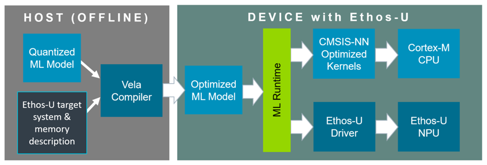

# General

This documentation is organized as follows:

- This chapter introduces the terminology, architecture, and deployment flow for
  ML models on an Edge AI MCU.
- <a href="../vela/index.html">Vela</a> explains how to install and use the Vela compiler,
  obtain or create an Ethos-U configuration, create matching linker and driver
  configurations, and publish the configuration in a DFP.
- <a href="../driver/index.html">Driver</a> describes the low-level Ethos-U driver API,
  execution contract, platform hooks, and bring-up checks.
- <a href="../integration/index.html">Integration</a> explains how to keep the compiled ML
  model, memory placement, driver settings, and application consistent, and how
  to budget, validate, and tune the complete system.
- <a href="../zephyr/index.html">Zephyr</a> explains how to configure, build, and run an
  Ethos-U-accelerated Zephyr application.

## Target audiences

In this documentation, an **Edge AI MCU** combines a Cortex-M processor with an
integrated Ethos-U NPU. This documentation is intended for:

- Embedded application developers who build and deploy ML applications on
  Edge AI MCUs.
- Silicon vendors who supply and validate the device-specific platform
  configuration, and platform maintainers who package and integrate that
  configuration for embedded application developers.

## Device packs

A CMSIS Device Family Pack (DFP) can simplify integration by including Ethos-U
resources such as the `vela.ini` configuration file, linker scripts, and
software components. Device packs are available from
[www.keil.arm.com/packs](https://www.keil.arm.com/packs). CMSIS-Toolbox uses
these resources for the selected device and build context and exposes the
relevant parameters through its [MLOps information](https://open-cmsis-pack.github.io/cmsis-toolbox/build-overview/#mlops-information).
See <a href="../vela/index.html#publish-ethos-u-configuration-in-a-dfp">Publish Ethos-U configuration in a DFP</a>
for the relevant DFP description entries.

When a DFP contains Ethos-U resources, embedded application developers can use
the validated device-specific files directly. The silicon vendor is responsible
for supplying and validating the platform configuration. This includes the Vela
system configuration and supported memory modes, matching NPU access settings,
and the physical memory requirements. A platform maintainer can package and
integrate this configuration for a board or software environment. If a suitable
DFP is unavailable, this documentation also supports manual integration.

## Key terms

This documentation uses the following terms:

- **Vela compiler** means the model-compilation tool.
- **`vela.ini` configuration** means the configuration file for the Vela compiler
  that describes the system configurations and memory modes of the target system.
- **ML model** or **neural network model** means the machine-learning workload
  being compiled and deployed.
- **ML inference runtime** means the software framework that interprets model
  metadata, prepares tensors, and invokes the Ethos-U driver.
- **Target system** means the complete Cortex-M-based hardware (with Ethos-U)
  and firmware platform.
- **Ethos-U target** means the selected NPU architecture and MAC configuration.

The following terms describe the Ethos-U compilation model and its memory
interface:

- **Command stream** means the NPU instructions generated by the Vela compiler
  and embedded in or emitted with the compiled model.
- **Constant area (`const_mem_area`)** means read-mostly model data such as
  encoded weights and scales.
- **Arena (`arena_mem_area`)** means input, output, intermediate activation,
  and compiler-managed working storage.
- **Fast staging/cache area (`cache_mem_area`)** means optional fast temporary
  storage used for spilling.
- **Fast-memory budget (`arena_cache_size`)** means the maximum amount of fast
  memory that Vela can use when optimizing for performance. It is not
  necessarily the final allocation size.
- **System configuration** means the performance model for the target memory
  system defined in `vela.ini`.
- **Memory mode** means the mapping of model storage roles to memory aliases
  defined in `vela.ini`.

## System overview

An Ethos-U NPU is a memory-mapped accelerator controlled by Cortex-M software.
The Vela compiler performs target-specific compilation before deployment. The
ML inference runtime coordinates CPU operations and the parts of the model that
are delegated to the NPU.

The diagram shows a common TensorFlow Lite deployment, in which CPU operations
can use [CMSIS-NN](https://www.keil.arm.com/packs/cmsis-nn-arm). Other ML
inference runtimes package delegated NPU operations differently but use the same
driver execution contract.

### How an Ethos-U inference runs

Before deployment, the model compilation flow identifies the quantized
partitions that can execute on the selected Ethos-U target. Vela compiles each
supported partition into a target-specific command stream and prepares its
constants and memory-region layout. Operations that are not delegated remain
available for execution by the ML inference runtime on the CPU.

At runtime:

1. The ML inference runtime prepares input, output, and working tensor memory.
2. When execution reaches a delegated partition, the runtime passes its
   compiled payload and memory-region base addresses to the Ethos-U driver.
3. The Ethos-U driver programs the command-stream and region information, and starts
   the NPU.
4. The NPU fetches the command stream and referenced data, executes the
   compiled tensor operations, and writes intermediate and output data to the
   configured regions.
5. The NPU signals completion or a fault. The interrupt handler records the
   result and wakes the waiting application or runtime.
6. Execution continues with the next CPU operation, delegated partition, or
   application post-processing step.

A single model invocation can therefore cause more than one Ethos-U driver
invocation.

### What is the command stream?

The command stream is the target-specific sequence of NPU instructions
generated by Vela for one delegated Ethos-U partition. Conceptually, it
describes data transfers, tensor-operation configuration, execution, and result
storage.

The command stream does not contain all the information needed to run
independently. It refers to numbered memory regions and offsets. At runtime, the
ML inference runtime and driver provide the base addresses for the regions
containing constants, tensor data, and optional fast scratch storage.

Frameworks package this information differently. An optimized TensorFlow Lite
model embeds it in Ethos-U custom operators, while an ExecuTorch program
packages delegated command streams in its backend data. In either case, the
Ethos-U driver ultimately submits a command stream and its region base addresses
to the NPU.

#### Target-specific command streams

The overall execution flow is common to Ethos-U55, Ethos-U65, and Ethos-U85,
but command streams are compiled for a specific architecture and MAC
configuration. Always compile for the exact target. Hardware pipelines,
supported operations, memory interfaces, and configuration details are
described in the corresponding Technical Reference Manual.

For command-line options and compiler diagnostics, see
<a href="../vela/index.html">Vela</a>. For invocation and interrupt contracts, see
<a href="../driver/index.html">Driver</a>.

## Coordinating the device configuration

An Edge AI MCU has a fixed Cortex-M, Ethos-U, interconnect, and memory
integration. The software descriptions used to build an application must match
that finished device:

1. The device description identifies the processor, Ethos-U configuration, and
   available memory regions.
2. The `vela.ini` configuration models the device's memory performance and
   defines its supported memory modes.
3. The linker and MPU/SAU configuration place code and data in the device's
   physical memory regions with suitable CPU attributes.
4. The driver configuration assigns the command stream and model regions to the
   matching NPU memory-access paths and attributes.

A DFP can provide these related configuration artifacts, and CMSIS-Toolbox can
resolve them for the selected device and build context. The artifacts must be
consistent. The full mapping, examples, and consistency checklist are in
<a href="../integration/index.html">Integration</a>. The meaning and syntax of `vela.ini`
are in <a href="../vela/index.html">Vela</a>.

## Memory configuration terminology

Memory configuration spans several description layers. Similar names at
different layers do not refer to the same object:

| Layer | Examples | Meaning |
|---|---|---|
| Physical memory | SRAM, Flash or MRAM, DRAM | Storage implemented by the device and connected through its interconnect. |
| Vela memory type | `Sram`, `OnChipFlash`, `OffChipFlash`, `Dram` | Performance-model category used by a Vela system configuration. |
| Vela logical alias | `Axi0`, `Axi1` | Logical memory domain used by a Vela memory mode. An alias does not necessarily represent one physical AXI port. |
| Vela data role | `const_mem_area`, `arena_mem_area`, `cache_mem_area` | Kind of generated model data assigned to a logical memory domain. |
| Runtime allocation | Compiled model, tensor arena, optional fast-scratch buffer | Actual linked or dynamically allocated storage used for inference. |
| Driver access configuration | `NPU_QCONFIG`, `NPU_REGIONCFG_0..7` | NPU access route and attributes used for the command stream and base-pointer regions. |

The selected memory mode maps Vela data roles to logical aliases. The system
configuration maps those aliases to Vela memory types. The linker and runtime
then place the corresponding allocations in physical memory, and the driver
must select matching NPU access routes. See
<a href="../vela/index.html#memory-mode-parameters">Vela memory mode parameters</a>
for the exact configuration keys and
<a href="../integration/index.html#configure-memory-placement-and-the-linker-script">Configure memory placement and the linker script</a>
for the end-to-end mapping.

## System configuration and memory modes at a glance

Ethos-U uses AXI bus interfaces for DMA memory access. The memory access timing
for the different data classes has a direct impact on overall performance.
Vela optimizes ML model execution based on system and memory parameters in the
`vela.ini` file.

Vela uses the logical aliases `Axi0` and `Axi1` to model memory placement and
performance. The selected system configuration maps each alias to a Vela memory
type. These aliases are compiler labels, not necessarily the names or number of
physical AXI ports implemented by the NPU.

In a common Ethos-U55 integration, `Axi0` represents read/write SRAM and `Axi1`
represents a read-only path to Flash. Do not apply that read-only restriction to
the `Axi1` alias on every Ethos-U target. The device integration and its
`vela.ini` file define the actual mapping.

The following diagram compares the commonly used memory modes.

**SRAM-only mode**       | **Shared-SRAM mode**    | **Dedicated-SRAM mode** |
:------------------------|:------------------------|:------------------------|
All Vela-managed model storage is placed in SRAM. Constants and the writable arena remain separate logical areas, but both use the same physical memory type. This mode provides low access latency, but the complete compiled model and arena must fit in SRAM. | The writable arena is stored in SRAM. Read-only constants, such as encoded weights and scales, are stored in Flash, MRAM, or DRAM. This arrangement minimizes SRAM usage. | Constants and the writable arena are outside the fast SRAM, normally in DRAM. SRAM is dedicated to fast staging storage. Vela uses spilling to move selected data through this area and reduce external-memory traffic. |

The diagram uses "Other Memory (Flash / DRAM)" as a compact label shared by
the three examples. In Dedicated-SRAM mode, `arena_mem_area` requires writable
memory, normally DRAM; read-only Flash can hold constants but not the arena. The
common Dedicated-SRAM flow applies to Ethos-U65 and Ethos-U85. It is not a
practical Ethos-U55 mode because the Ethos-U55 AXI1 hardware interface is
read-only.

Vela maps to physical memory with the `system-config` and `memory-mode` options.
The related performance parameters are obtained from the device-specific
`vela.ini` file. See <a href="../vela/index.html">Vela</a> for command-line syntax and
<a href="../integration/index.html">Integration</a> for the corresponding linker sections,
MPU/SAU attributes, cache policy, and driver region configuration.

## Deployment lifecycle

1. Select the device and CMSIS-Toolbox build context. Use its DFP when the pack
   provides the required Ethos-U resources.
2. Select a quantized ML model and ML inference runtime, and supply
   the matching `vela.ini`, linker, and driver configuration.
3. Compile for size to establish the model-controlled memory floor.
4. Reserve memory for the ML inference runtime and application, then use the
   remaining budget to compile performance candidates.
5. Place model artifacts and buffers with the linker and configure the driver
   to match the same memory mapping.
6. Implement target hooks for interrupts, cache maintenance, address remapping,
   and RTOS synchronization as needed.
7. Validate correctness with a small known-good ML model. Then measure the
   production ML model on hardware and tune the system based on those results.

The detailed procedure and required evidence are in
<a href="../integration/index.html">Integration</a>. The Vela compiler's estimates are
useful for comparison but do not replace measurements on the target.

## Related resources

- [Ethos-U55](https://www.arm.com/products/silicon-ip-cpu/ethos/ethos-u55),
  [Ethos-U65](https://www.arm.com/products/silicon-ip-cpu/ethos/ethos-u65), and
  [Ethos-U85](https://www.arm.com/products/silicon-ip-cpu/ethos/ethos-u85)
- [Vela source and release documentation](https://gitlab.arm.com/artificial-intelligence/ethos-u/ethos-u-vela)
- [CMSIS-NN](https://www.keil.arm.com/packs/cmsis-nn-arm/overview/)
- [ExecuTorch Arm examples](https://github.com/pytorch/executorch/tree/main/examples/arm)
- [Arm Fixed Virtual Platforms](https://www.arm.com/products/development-tools/simulation/fixed-virtual-platforms)

The Technical Reference Manuals describe for each Ethos-U NPU functional behavior,
interfaces, memory system, programmer's model and registers, performance, and
debug features, and are intended primarily for SoC designers, system
integrators, verification engineers, and low-level software developers who need
hardware-specific details:

- [Ethos-U55 NPU Technical Reference Manual](https://developer.arm.com/documentation/102420/)
- [Ethos-U65 NPU Technical Reference Manual](https://developer.arm.com/documentation/102023/)
- [Ethos-U85 NPU Technical Reference Manual](https://developer.arm.com/documentation/102685/)
