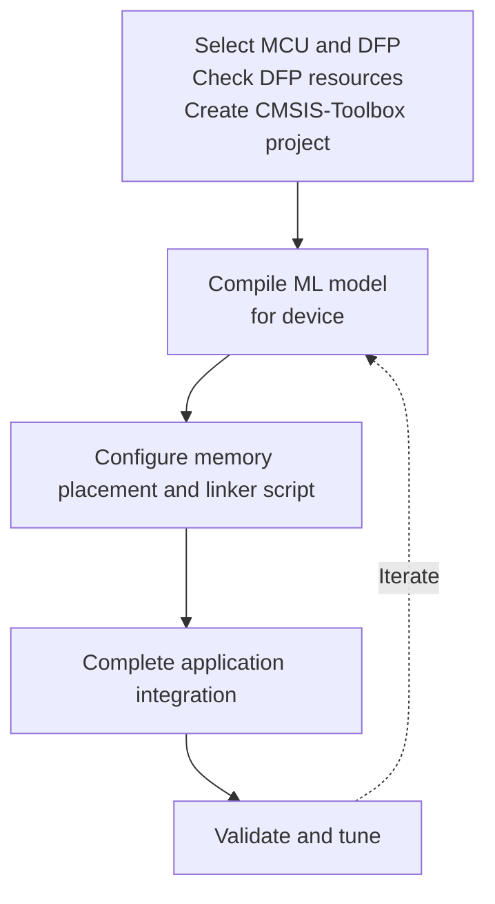
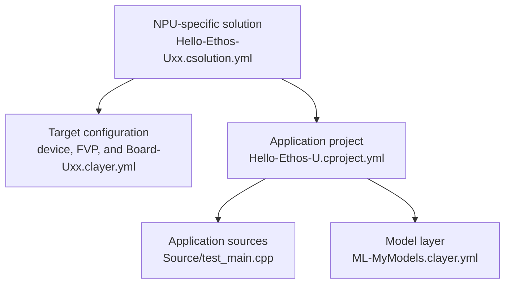
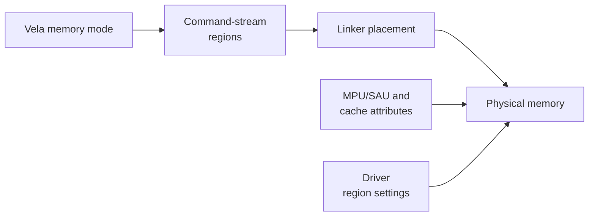

# Integration

This chapter explains how to integrate a pretrained, quantized ML model into an
Edge AI MCU based on Cortex-M and Ethos-U. Model training, quantization, and
functional accuracy validation are outside the scope of this integration flow.

## Starting point

The starting point is a pretrained, quantized ML model that meets the
application's functional requirements. Before selecting a specific Edge AI MCU,
compile the model with Vela for one or more Ethos-U reference systems as
described in
<a href="../vela/index.html#compare-ethos-u-configurations">Compare Ethos-U configurations</a>.

Vela reports operator placement and estimates memory use, bandwidth, and NPU
cycles. See <a href="../vela/index.html#read-the-vela-reports">Read the Vela reports</a>.
Use these results for device selection, then validate with a device-specific
compile and measurements on the target hardware.

Some model zoos may provide corresponding performance and memory data for
Ethos-U-based systems. Confirm that the published configuration is relevant to
the candidate device before using those results.

### Determine the memory budget

Estimate the application's memory needs before selecting a device:

- Compile the ML model with the optimization strategy that matches the
  application requirements, and record the reported memory areas. Use
  `--optimise Size` to minimize memory use or `--optimise Performance` when
  performance is the priority and sufficient memory is available. See
  <a href="../vela/index.html#memory-mode-parameters">Vela memory mode parameters</a>.
- Add runtime and application data, stacks, heaps,
  alignment, padding, and a safety margin.

After the application runs on the target, the remaining memory can be used to
tune performance. See <a href="../vela/index.html#understand-arena-cache-and-spilling">Understand arena cache and spilling</a>.

## Integration workflow

The diagram summarizes the integration workflow and its iteration loop. Follow
the detailed steps in order because later steps depend on earlier decisions and
measurements.



1. <a href="#step-1-select-the-mcu-and-create-the-project"><strong>Select the MCU and create the project.</strong></a>
   Install its [DFP](https://www.keil.arm.com/packs), check that it supplies the
   required Vela and linker resources, and select the system configuration and
   memory mode. Contact the device vendor if these resources are missing.
2. <a href="#step-2-compile-the-ml-model"><strong>Compile the ML model.</strong></a>
   Run Vela with the device-specific settings and check its memory and
   performance estimates against the application requirements.
3. <a href="#step-3-configure-memory-placement"><strong>Configure memory placement.</strong></a>
   Keep the Vela memory mode, linker placement, and driver regions consistent.
   Build the system and confirm the allocations in the linker map.
4. <a href="#step-4-complete-application-integration"><strong>Complete application integration.</strong></a>
   Add the required RTOS, power, timeout, cache, and fault handling.
5. <a href="#step-5-validate-and-tune"><strong>Validate and tune.</strong></a> Verify
   correctness, memory use, and performance on the target hardware.

## Tutorial: Create an Ethos-U application

This tutorial uses
[Keil Studio for VS Code](https://marketplace.visualstudio.com/items?itemName=Arm.keil-studio-pack),
available from the VS Code Marketplace. Command-line users may use the  [CMSIS-Toolbox](https://open-cmsis-pack.github.io/cmsis-toolbox/) with a similar workflow.

### Start with an example

This tutorial applies the five-step workflow to the `Hello-Ethos-U` examples in
the `ARM::CMSIS-Ethos-U` pack. The three examples have the same application
structure and uses the same ML models. Each example targets a different Ethos-U
variant.

In Keil Studio, use **Create a New Solution** as described in
[Work with CMSIS solutions](https://mdk-packs.github.io/vscode-cmsis-solution-docs/create_app.html).
From the table, select the target board and corresponding example that matches
the Ethos-U variant in the target hardware. After creating the example, you can
compile it and run it directly on the FVP simulation with the
[action buttons](https://github.com/Open-CMSIS-Pack/vscode-cmsis-solution#action-buttons)
in the
[CMSIS view](https://mdk-packs.github.io/vscode-cmsis-solution-docs/userinterface.html#2-main-area-of-the-cmsis-view).
Keil Studio automatically downloads and installs the required tools and
software packs. The initial setup may take some time.

Target board                 | Example                         | NPU/MACs      | FVP simulation model
:----------------------------|:--------------------------------|:--------------|:-------------------
V2M-MPS3-SSE-300-FVP         | `Hello-Ethos-U55.csolution.yml` | Ethos-U55-128 | Corstone-300
V2M-MPS3-SSE-300-FVP         | `Hello-Ethos-U65.csolution.yml` | Ethos-U65-256 | Corstone-300
SSE-320                      | `Hello-Ethos-U85.csolution.yml` | Ethos-U85-256 | Corstone-320

Each example includes the `Hello-Ethos-U.cproject.yml` file and the
software layers shown in this diagram:



The model layer supplies two quantized TensorFlow Lite (`int8`) models:
`hello_world`, a dense network that approximates `sin(x)`, and `tiny_cnn`, an
image classifier that exercises convolution and pooling operations. The
application runs one test input through each model on the selected NPU and
checks both results against embedded reference output.

When both model checks pass, the FVP simulation model outputs:

```text
2 of 2 checks passed
TEST RESULT: PASS
```

This confirms that the example and tool setup work correctly.

Use the supplied layer as a known-good baseline to verify the system integration
and tool setup. Once verified, replace it with a layer containing the
application-specific ML model.

> [!NOTE]
>
> - The committed ML model artifacts are precompiled for Ethos-U55-128. Follow
>   Step 2 to compile them for the NPU configuration of the selected target.
> - The Corstone examples can also test Ethos-U65 and Ethos-U85 targets with the
>   corresponding FVP models. Keep the accelerator and MAC configuration
>   consistent in the solution MLOps information, Board layer, Vela command, and
>   FVP configuration.

### Step 1: Select the MCU and create the project

For our application, we selected the Alif Semiconductor
[Ensemble E7 (`AE722F80F55D5LS`)](https://www.keil.arm.com/devices/alif-semiconductor-ae722f80f55d5ls/)
device and the related
[AppKit-E7-AIML](https://www.keil.arm.com/boards/alif-semiconductor-appkit-e7-aiml-d1-34b5d51/)
board. We target the Ethos-U55 NPU on this device and therefore start with
`Hello-Ethos-U55.csolution.yml`.

#### Add a new target to the solution

Open `Hello-Ethos-U55.csolution.yml` and add the DFP and BSP packs required by
the selected device and board. Use the information in the
[CMSIS-Pack catalog](https://www.keil.arm.com/packs/) to identify these packs.
Then add a hardware target to the `target-types:` node before the existing FVP
target. For the E7 device and AppKit, the relevant parts of the solution are:

```yaml
  packs:
    - pack: AlifSemiconductor::Ensemble
    # Keep the existing packs
    - pack: ARM::V2M_MPS3_SSE_300_BSP@1.5.0

  target-types:
    - type: AppKit-E7
      board: Alif Semiconductor::AppKit-E7-AIML
      device: Alif Semiconductor::AE722F80F55D5LS

    # Keep the existing target for validating with FVP simulation model.
    - type: SSE-300-U55
      board: ARM::V2M-MPS3-SSE-300-FVP
      device: ARM::SSE-300-MPS3

```

Save the solution. Keil Studio discovers compatible board layers in the
installed packs and prompts you to select one. The Alif E7 pack provides two
layers for the AppKit-E7-AIML board:

- `Board/AppKit-E7_M55_HE` configures the `M55_HE` processor.
- `Board/AppKit-E7_M55_HP` configures the `M55_HP` processor.

This example uses the `Board/AppKit-E7_M55_HP` layer.

> [!TIP]
> When no compatible board layer exists, create one based on the supplied FVP
> board layer. This example requires standard output and the Ethos-U driver. See
> [Board Layers](https://open-cmsis-pack.github.io/cmsis-toolbox/ReferenceApplications/#board-layer)
> in the CMSIS-Toolbox documentation.

#### Update MLOps information

The [`mlops:` information in the `*.csolution.yml` file](https://open-cmsis-pack.github.io/cmsis-toolbox/build-overview/#mlops-information)
describes the NPU, Vela configuration, model layer, and test targets used by an
MLOps system. Update this information in two stages.

##### Stage 1: Update the Ethos-U configuration

First select the NPU independently of its memory configuration. The Alif E7
`M55_HP` processor integrates an Ethos-U55 with 256 MACs, so change `macs:` from
`128` to `256` in `Hello-Ethos-U55.csolution.yml`:

```yml
  mlops:
    description: TinyCNN int8 image classifier for Ethos-U55
    npu:
      type: Ethos-U55
      macs: 256      # Must match the hardware target
```

> [!NOTE]
> For the complete syntax of the `mlops:` node, see [MLOps Management](https://open-cmsis-pack.github.io/cmsis-toolbox/YML-Input-Format/#mlops-management) in the CMSIS-Toolbox manual.

In Keil Studio, saving the solution runs `cbuild setup` and regenerates
`Hello-Ethos-U55.cbuild-mlops.yml`. CMSIS-Toolbox combines the MLOps settings
with the NPU and processor information published by the selected device and DFP.

##### Stage 2: Verify and update the Vela configuration

Inspect the `vela:` section of the generated `*.cbuild-mlops.yml` file. Its
`ini:` entry identifies the device-specific `vela.ini` supplied by the DFP. For
example:

```yml
cbuild-mlops:
  generated-by: csolution version 2.14.1+p55-g119b477e
  description: TinyCNN int8 image classifier for Ethos-U55
  processor:
    type: Cortex-M55
  npu:
    type: Ethos-U55
    macs: 256
  vela:
    ini: .cmsis/ensemble_vela.ini    # Device-specific vela.ini file
    options: --accelerator-config ethos-u55-256 --system-config Ethos_U55_High_End_Embedded --memory-mode Shared_Sram
```

> [!NOTE]
> If the `vela:` section does not contain an `ini:` entry, check the DFP
> documentation or contact the silicon vendor for a configuration that
> describes the device.

The generated `options:` entry might initially contain a system configuration
or memory mode inherited from the original example. List the configurations and
memory modes that the device-specific `vela.ini` actually provides:

```console
vela --list-configs .cmsis/ensemble_vela.ini
```

Choose from the reported values by comparing the memory types, bandwidths,
clock frequency, and AXI mappings with the target hardware and intended model
placement. In the `*.csolution.yml` file, update the `vela:` node under
`mlops:` with selectors that are present in the device-specific `vela.ini`:

```yml
  mlops:
    description: TinyCNN int8 image classifier for Ethos-U55
    npu:
      type: Ethos-U55
      macs: 256
    vela:
      system: RTSS_HP_SRAM_MRAM # System configuration from the device-specific vela.ini
      memory: Shared_Sram       # Memory mode from the device-specific vela.ini
      misc: --optimise Performance --verbose-config # Additional Vela options
    model:
      clayer: ./Model/ML-MyModels.clayer.yml
      name: tiny_cnn_int8
#     path: Model/tiny_cnn      # feature to be added in CMSIS-Toolbox 2.15
```

Save the solution again. In the regenerated `*.cbuild-mlops.yml`, verify that
the `ini:` and `options:` entries under `vela:` contain the intended
configuration.

#### Configure 256 MACs for FVP simulation

The supplied Corstone-300 simulator target uses Ethos-U55-128 by default. To
test the same Ethos-U55-256 model that runs on the Alif E7, update the simulator
configuration as follows:

- In `Board/Corstone-300/Board-U55.clayer.yml`, set the compile-time driver
   configuration to:

   ```yml
   - ETHOSU_MACS: 256
   ```

- In `Board/Corstone-300/fvp_config_u55.txt`, configure the simulated NPU:

   ```ini
   ethosu.num_macs=256
   ```

### Step 2: Compile the ML model

#### Update ML models of the example

The example contains the original quantized TensorFlow Lite models and Vela
output compiled for the original Ethos-U55-128 configuration. Recompile each
quantized model for the Ethos-U55-256 configuration and the device-specific
system and memory mode that is reported in the generated `Hello-Ethos-U55.cbuild-mlops.yml` file.

These values can be directly applied to Vela. See [MLOps Information](https://open-cmsis-pack.github.io/cmsis-toolbox/build-overview/#mlops-information).

```console
vela Model/tiny_cnn/tiny_cnn_int8.tflite \
  --accelerator-config ethos-u55-256 \
  --config .cmsis/ensemble_vela.ini \
  --system-config RTSS_HP_SRAM_MRAM \
  --memory-mode Shared_Sram \
  --optimise Performance \
  --output-dir Model/tiny_cnn \
  --verbose-config
```

See <a href="../vela/index.html">Vela</a> for details about command-line options.
Options such as `--optimise Size` can be added with the `mlops.vela.misc:`
control in the `*.csolution.yml` file.

Repeat the command for every quantized model in the model layer. Replace the
previous Vela output used by the application and regenerate its embedded C data
if the project stores the model as a C array. Keep the original quantized
`.tflite` file as the portable input; the `_vela.tflite` output is specific to
the selected Ethos-U and memory configuration. For more information about this
handoff, see [MLOps Information](https://open-cmsis-pack.github.io/cmsis-toolbox/build-overview/#mlops-information).

#### Add application ML model

The supplied `ML-MyModels.clayer.yml` has the layer type `ML-Model`. It selects
the TensorFlow Lite Micro and Ethos-U kernel components and adds the model files
to the application. The layer contains:

- `model_data.h`, which declares the embedded models;
- `arena.c`, which reserves the shared tensor arena; and
- one directory per model with the original quantized `.tflite` file, the
  Vela-compiled `_vela.tflite` file, and the generated C array used by the
  application.

To use an application-specific model, copy or modify this layer, add the new
model files to its `groups:` node, and set `model.clayer` in the solution's
`mlops:` node to the resulting layer.

### Step 3: Configure memory placement

Keep the Vela memory mode, linker placement, and driver regions consistent,
then build the system and confirm the allocations in the linker map. The diagram
summarizes the required settings.



#### Linker placement

The examples place compiled model constants in the `ethos_model` section, the
tensor arena in `ethos_arena`, and an optional cache buffer in `ethos_cache`.
Map these sections to the physical memories selected by the Vela memory mode.
Preserve their alignment requirements and use the linker map to confirm their
addresses and sizes. See
<a href="../vela/index.html#create-the-linker-script">Create the linker script</a>
for the detailed mapping between Vela memory areas and linker sections.

#### MPU/SAU and cache attributes

Configure each memory region so that the CPU and NPU have the required security
and access permissions. If a CPU mapping is cacheable and is not coherent with
the NPU, provide the required cache clean and invalidate operations.

#### Driver region settings

Set `NPU_REGIONCFG_0`, `NPU_REGIONCFG_1`, and `NPU_REGIONCFG_2` as defines in
the related `<board>.clayer.yml` file so that the driver access paths match
`const_mem_area`, `arena_mem_area`, and `cache_mem_area`. See
<a href="../vela/index.html#match-the-driver-configuration">Match the driver configuration</a>
for the mapping.

### Step 4: Complete application integration

Review the driver's weak callbacks described in
<a href="../driver/index.html#platform-specific-functions">Platform-specific functions</a>
and override those required by the target. These callbacks provide cache
maintenance, CPU-to-NPU address remapping, run-time region selection, RTOS
synchronization, and begin/end inference hooks for power control or tracing.

Follow the related guidance for <a href="../driver/index.html#data-caching">data caching</a>,
<a href="../driver/index.html#mutex-and-semaphores">mutexes and semaphores</a>, and
<a href="../driver/index.html#beginend-inference-callbacks">begin/end inference callbacks</a>.
Configure a finite inference timeout where appropriate, report NPU faults, and
complete the <a href="../driver/index.html#driver-bring-up-checklist">driver bring-up checklist</a>
before relying on the integration in an application.

### Step 5: Validate and tune

Verify correctness, memory use, and performance on the target hardware.

- Run representative inputs and compare every output with known-good reference
  data. Check that Vela placed the expected operators on the NPU.
- Inspect the linker map and exercise the maximum expected tensor-arena, stack,
  and heap usage. Confirm that no region overlaps or exceeds its allocation.
- Measure several inference iterations on hardware, including warm-up behavior,
  and use the driver <a href="../driver/index.html#performance-monitoring-unit-pmu">PMU</a>
  to investigate NPU activity and stalls.
- Repeat inference under the intended RTOS, cache, and power conditions. Verify
  that timeout and fault paths terminate cleanly and report useful diagnostics.

When tuning, change one parameter at a time, such as the Vela memory mode,
`arena_cache_size`, or optimization strategy, then recompile and repeat the
checks. Use <a href="../vela/index.html#read-the-vela-reports">Read the Vela reports</a>
and <a href="../vela/index.html#compare-ethos-u-configurations">Compare Ethos-U configurations</a>
to record and compare the results.

## Troubleshooting an inference that does not complete

During bring-up, provide a watchdog or RTOS timeout so that a missing completion
interrupt does not block the application indefinitely. If an inference times
out, capture the driver logs and NPU state before resetting the NPU. Check the
following areas:

- **Interrupt delivery:** Verify the NPU interrupt number, enable state,
  priority, security routing, and vector-table entry. Confirm that the ISR calls
  \ref ethosu_irq_handler "ethosu_irq_handler()" with the correct driver
  instance. If the NPU `STATUS` register reports command completion or a fault
  while the application remains blocked, inspect the interrupt path and the
  RTOS semaphore implementation.
- **NPU status and progress:** Enable driver logging and record `STATUS` and
  `QREAD`. Fault status indicates a command-stream, memory-access, security, or
  hardware error. If `QREAD` does not advance, check the NPU clock and power,
  command-stream address and size, address remapping, and command-stream cache
  cleaning.
- **Memory access:** If `QREAD` advances and then stops, verify all base-pointer
  addresses and sizes, `NPU_REGIONCFG_x` values, physical memory placement,
  MPU/SAU and interconnect permissions, and cache maintenance. Confirm that the
  command stream, constants, tensor arena, and any scratch-fast buffer are all
  accessible to the NPU.
- **Synchronization:** For asynchronous invocation, call `ethosu_wait()` only
  after `ethosu_invoke_async()` succeeds. For an RTOS integration, verify that
  the semaphore hooks wake the waiting task and that timeout units have the
  expected meaning.
- **Recovery and isolation:** Preserve fault information, then use
  \ref ethosu_soft_reset "ethosu_soft_reset()" before another submission. Retry
  with a minimal known-good model to separate platform integration faults from
  model-specific failures.


## Advanced topics

<!-- Future topics:
- CPU/NPU address remapping
- Multi-NPU or multi-variant configurations
- Cache-coherency strategies
- Run-time selection of driver regions
-->

### Use separate scratch-fast memory on Ethos-U65 and Ethos-U85

Ethos-U65 and Ethos-U85 can use a memory mode in which `arena_mem_area` and
`cache_mem_area` resolve to different memory types. The tensor arena can reside
in external writable memory while a faster SRAM region is used for staging.
This arrangement is not applicable to Ethos-U55 because its AXI1 interface is
read-only.

Select a compatible memory mode and set `arena_cache_size` to the available
scratch-fast capacity. Reserve the `cache_mem_area` in the linker script and
configure its MPU/SAU, cache, and driver region settings consistently. See
<a href="../vela/index.html#understand-arena-cache-and-spilling">Understand arena cache and spilling</a>
and <a href="../vela/index.html#create-the-linker-script">Create the linker script</a>.

### Move the tensor arena to external DRAM on Ethos-U65 and Ethos-U85

Assume that the selected target provides NPU-accessible external DRAM and that
the tensor arena currently resides in SRAM. Moving it to DRAM requires these
coordinated changes:

- **Vela:** Select a compatible `Memory_Mode` in which `arena_mem_area` resolves
  to the target's external DRAM access path. Keep the target's `System_Config`
  fixed.
- **Linker:** Move the `ethos_arena` section to the DRAM memory region, preserve
  its required alignment, and use the linker map to confirm that it fits.
- **MPU/SAU and cache policy:** Configure the DRAM attributes so that the
  runtime and NPU have the required access and the CPU cache policy is explicit.
- **Driver:** Set `NPU_REGIONCFG_1`, which represents `arena_mem_area`, to the
  target-specific external-memory access path. Override
  `ethosu_address_remap()` if the CPU and NPU use different DRAM addresses.
- **Cache hooks:** If the CPU mapping is cacheable and is not coherent with the
  NPU, implement `ethosu_flush_dcache()` before NPU reads and
  `ethosu_invalidate_dcache()` after NPU writes. Cache maintenance is not needed
  for a non-cacheable or hardware-coherent mapping.
- **Validation:** Rebuild and verify the linker-map placement, NPU access, model
  correctness, memory use, and performance on the target.
