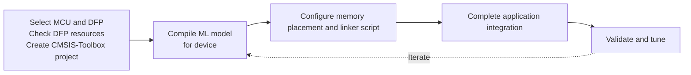
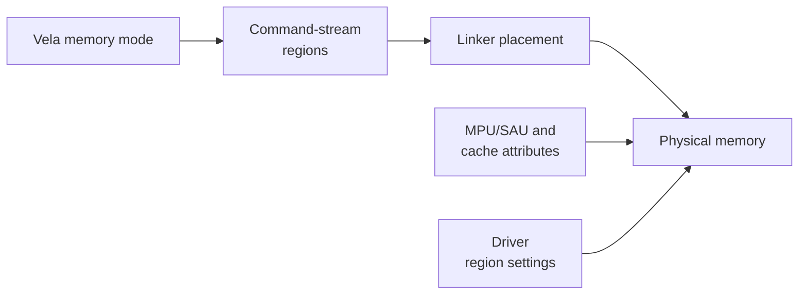
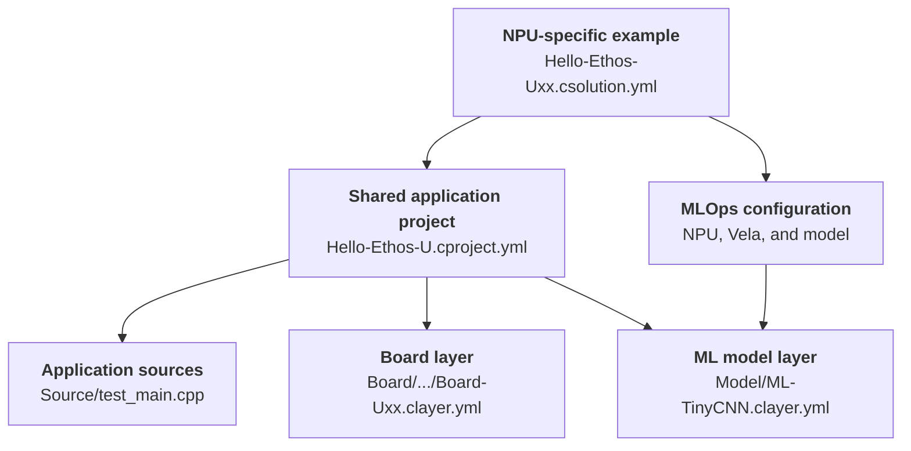

# Integration

This chapter explains how to integrate a pretrained, quantized ML model into an
Edge AI MCU based on Cortex-M and Ethos-U. Model training, quantization, and
functional accuracy validation are outside the scope of this integration flow.

## Starting point

The starting point is a pretrained, quantized ML model that meets the
application's functional requirements. Before selecting a specific Edge AI MCU,
compile the model with Vela for one or more Ethos-U reference systems as
described in
<a href="../vela/index.html#compare-ethos-u-configurations">Compare Ethos-U configurations</a>.

Vela reports operator placement and estimates memory use, bandwidth, and NPU
cycles. See <a href="../vela/index.html#read-the-vela-reports">Read the Vela reports</a>.
Use these results for device selection, then validate with a device-specific
compile and measurements on the target hardware.

Some model zoos may provide corresponding performance and memory data for
Ethos-U-based systems. Confirm that the published configuration is relevant to
the candidate device before using those results.

### Determine the memory budget

Most embedded applications are resource-constrained and therefore the memory budget is an important aspect. Use this three-step approach to estimate the total memory requirements of the application:

- **Evaluate the ML model memory requirement.** Compile the ML model with
  `--optimise Size` and record the reported memory
  areas. See <a href="../vela/index.html#memory-mode-parameters">Vela memory mode parameters</a>.
- **Build the system budget.** Add runtime and application data, stacks, heaps,
  alignment, padding, and a safety margin.
- **Tune and optimize.** Use the remaining memory budget for performance gains.
  Keep the Vela system configuration for the selected target fixed. Evaluate
  compatible memory modes and NPU cache-size variants, such as
  `Dedicated_Sram_256KB`, or tune the cache size with `--arena-cache-size` as
  described in <a href="../vela/index.html#understand-arena-cache-and-spilling">Understand arena cache and spilling</a>.

## Integration workflow

The diagram summarizes the integration workflow and its iteration loop. Follow
the detailed steps in order because later steps depend on earlier decisions and
measurements.



1. **Select the Edge AI MCU and DFP.** Compare the reference results with the
   device's NPU configuration and memory capacity and with the application's
   performance requirements. Obtain the matching Device Family Pack (DFP) from
   [www.keil.arm.com/packs](https://www.keil.arm.com/packs).
2. **Check the DFP resources.** Determine whether the DFP provides a
   device-specific `vela.ini` file, matching linker scripts, and other required
   resources. Creating a reliable, optimized `vela.ini` file requires detailed
   information about the device memory and interconnect. If the DFP does not
   provide this configuration, contact the device or SoC vendor. See
   <a href="../vela/index.html#create-device-specific-velaini-file">create a device-specific <code>vela.ini</code> file</a>,
   or contact the Arm CMSIS support team at
   CMSIS\@arm.com for assistance.
3. <a href="#create-the-csolution-project"><strong>Create the CMSIS-Toolbox project.</strong></a> Select the device and build context, and specify the Vela system configuration and memory mode.
   Use the generated [MLOps information](https://open-cmsis-pack.github.io/cmsis-toolbox/build-overview/#mlops-information)
   to obtain the Vela parameters and resources supplied by the DFP.
4. <a href="#compile-the-ml-model-for-the-device"><strong>Compile the ML model for the device.</strong></a> Run Vela with the device-specific
   parameters and confirm that its performance and memory estimates meet the
   application requirements. Treat the performance figures as first-order,
   model-dependent estimates. As initial guidance, budget for the cycle count
   or latency to be 30% higher than the Vela estimate, and refine this margin
   after the first target benchmarks.
5. <a href="#configure-memory-placement-and-the-linker-script"><strong>Configure memory placement and the linker script.</strong></a> Keep the Vela memory
   mode, linker placement, and driver region configuration consistent. Account
   for the ML inference runtime, stacks, heaps, application data, alignment, and
   a safety margin. Build the system and inspect the linker map. Ensure that the
   model constants, tensor arena, and any separate scratch-fast buffer are in
   the expected physical memories, fit within their allocated regions, and are
   accessible to the runtime and NPU. The examples use the linker sections
   `ethos_model`, `ethos_arena`, and `ethos_cache`, respectively.
6. <a href="#complete-application-integration"><strong>Complete application integration.</strong></a> Add any application-specific RTOS,
   power, timeout, cache, and fault handling.
7. <a href="#validate-and-tune"><strong>Validate and tune.</strong></a> Verify correctness, memory allocation, ML model performance,
   bandwidth, latency, and concurrency on the actual target system.

Treat memory placement as a system-wide property. Reflect every placement change
consistently in the Vela memory mode, linker script, MPU/SAU and cache
attributes, driver region configuration, and any cache or address-remapping
hooks.

### General integration guidance

- Keep the `vela.ini`, `System_Config`, selected `Memory_Mode`, linker sections,
  MPU/SAU attributes, and driver build definitions consistent.
- Apply `arena_cache_size` according to the selected memory mode as described in
  <a href="../vela/index.html#understand-arena-cache-and-spilling">Understand arena cache and spilling</a>.
- Place model constants, activations, and any separate scratch-fast storage as
  described in
  <a href="../vela/index.html#create-the-linker-script">Create the linker script</a>.
- Override the driver weak hooks when the default integration assumptions do not
  match the platform, especially for data cache maintenance, address remapping,
  and RTOS synchronization.
- Route the NPU completion and fault interrupt to \ref ethosu_irq_handler
  "ethosu_irq_handler()" and ensure that it remains serviceable. Very low jitter
  is usually not required for inference workloads, but completion handling must
  not be postponed indefinitely.
- During bring-up, follow the
  <a href="../driver/index.html#driver-bring-up-checklist">Driver bring-up checklist</a>.
  Use timeouts, fault reporting, and a minimal known-good model before moving to
  full application graphs.

#### Example: Move the tensor arena from SRAM to external DRAM

Assume that the selected target provides NPU-accessible external DRAM and that
the tensor arena currently resides in SRAM. Moving it to DRAM requires these
coordinated changes:

- **Vela:** Select a compatible `Memory_Mode` in which `arena_mem_area` resolves
  to the target's external DRAM access path. Keep the target's `System_Config`
  fixed.
- **Linker:** Move the `ethos_arena` section to the DRAM memory region, preserve
  its required alignment, and use the linker map to confirm that it fits.
- **MPU/SAU and cache policy:** Configure the DRAM attributes so that the
  runtime and NPU have the required access and the CPU cache policy is explicit.
- **Driver:** Set `NPU_REGIONCFG_1`, which represents `arena_mem_area`, to the
  target-specific external-memory access path. Override
  `ethosu_address_remap()` if the CPU and NPU use different DRAM addresses.
- **Cache hooks:** If the CPU mapping is cacheable and is not coherent with the
  NPU, implement `ethosu_flush_dcache()` before NPU reads and
  `ethosu_invalidate_dcache()` after NPU writes. Cache maintenance is not needed
  for a non-cacheable or hardware-coherent mapping.
- **Validation:** Rebuild and verify the linker-map placement, NPU access, model
  correctness, memory use, and performance on the target.

### Add ML model and configuration to version control

It is good practice to document the handoff boundary between model, platform, and application
engineers. This also gives automated tools enough context to check consistency.
CMSIS-Toolbox already records the selected packs and `vela.ini` configuration
file in the *csolution project* files and in the metafiles `*.cbuild-pack.yml` and `*.cbuild-mlops.yml`.
Keep these files along with the input ML model under version control.

## Create the *csolution project*

CMSIS-Toolbox simplifies MLOps by combining device and DFP data with project
settings into machine-readable
[MLOps information](https://open-cmsis-pack.github.io/cmsis-toolbox/build-overview/#mlops-information)
that tools can use to compile the pretrained ML model for the selected target
and test the resulting artifacts on hardware or a simulator.

### MLOps information

The `mlops:` node in the `*.csolution.yml` file configures [MLOps Management](https://open-cmsis-pack.github.io/cmsis-toolbox/YML-Input-Format/#mlops-management).
CMSIS-Toolbox combines this information with the selected device and DFP and generates the [`*.cbuild-mlops.yml`](https://open-cmsis-pack.github.io/cmsis-toolbox/YML-CBuild-Format/#cbuild-mlopsyml) file for the MLOps workflow.

The following example selects an Ethos-U55 configuration and identifies the software layer that contains the ML model:

```yaml
solution:
  mlops:
    description: Person detection model
    npu:
      type: Ethos-U55
      macs: 128
    vela:
      system: Ethos_U55_High_End_Embedded
      memory: Shared_Sram
    model:
      clayer: $ML-Layer$      # this can also be an absolute path
```

### Add ML model layer

Replace the NPU and Vela selectors with values supported by the selected device
and set `model.clayer` to the layer that contains the model. The example omits
`vela.ini`, so CMSIS-Toolbox uses the configuration supplied by the device or
DFP.

## Compile the ML model for the device

CMSIS-Toolbox combines DFP information with the csolution project configuration
and generates the MLOps information file `*.cbuild-mlops.yml`. The `vela:` node provides the `ini:` configuration file and `options:` that can be used to invoke Vela.

```console
vela --config <vela.ini> <vela.options> ml-model.tflite
```

## Configure memory placement and the linker script

The diagram summarizes the settings that must describe a consistent mapping to
physical memory.



The common relationship between compiler memory areas and driver regions is
described in
<a href="../vela/index.html#match-the-driver-configuration">Match the driver configuration</a>.
The generated command stream uses numeric NPU regions, also
called base pointer indices; it does not use the `Axi0` or `Axi1` aliases.

Generated commands such as `NPU_SET_IFM_REGION`, `NPU_SET_OFM_REGION`,
`NPU_SET_WEIGHT_REGION`, `NPU_SET_SCALE_REGION`, `NPU_SET_DMA0_SRC_REGION`, and
`NPU_SET_DMA0_DST_REGION` carry region numbers and offsets. The runtime and
driver supply the base addresses and memory attributes for those regions.

The following driver sections explain the platform hooks and region attributes
that must agree with this placement.

Create the physical sections for model constants, the tensor arena, and any
separate scratch-fast storage as described in
<a href="../vela/index.html#create-the-linker-script">Create the linker script</a>. Use the
linker map to verify that their addresses and sizes match the selected memory
mode and that every generated NPU region is accessible through the driver
configuration.

## Complete application integration

Validate interrupt wiring alongside Vela, linker, MPU/SAU, cache, and driver
settings. Use the
<a href="../driver/index.html#driver-bring-up-checklist">Driver bring-up checklist</a>
for the first target execution, then complete the end-to-end validation in
<a href="#validate-and-tune">Validate and tune</a>.

### Troubleshoot an inference that does not complete

During bring-up, provide a watchdog or RTOS timeout so that a missing completion
interrupt does not block the application indefinitely. If an inference times
out, capture the driver logs and NPU state before resetting the NPU. Check the
following areas:

- **Interrupt delivery:** Verify the NPU interrupt number, enable state,
  priority, security routing, and vector-table entry. Confirm that the ISR calls
  \ref ethosu_irq_handler "ethosu_irq_handler()" with the correct driver
  instance. If the NPU `STATUS` register reports command completion or a fault
  while the application remains blocked, inspect the interrupt path and the
  RTOS semaphore implementation.
- **NPU status and progress:** Enable driver logging and record `STATUS` and
  `QREAD`. Fault status indicates a command-stream, memory-access, security, or
  hardware error. If `QREAD` does not advance, check the NPU clock and power,
  command-stream address and size, address remapping, and command-stream cache
  cleaning.
- **Memory access:** If `QREAD` advances and then stops, verify all base-pointer
  addresses and sizes, `NPU_REGIONCFG_x` values, physical memory placement,
  MPU/SAU and interconnect permissions, and cache maintenance. Confirm that the
  command stream, constants, tensor arena, and any scratch-fast buffer are all
  accessible to the NPU.
- **Synchronization:** For asynchronous invocation, call `ethosu_wait()` only
  after `ethosu_invoke_async()` succeeds. For an RTOS integration, verify that
  the semaphore hooks wake the waiting task and that timeout units have the
  expected meaning.
- **Recovery and isolation:** Preserve fault information, then use
  \ref ethosu_soft_reset "ethosu_soft_reset()" before another submission. Retry
  with a minimal known-good model to separate platform integration faults from
  model-specific failures.


## Validate and tune

## Tutorial

This tutorial explains the end-to-end process of generating an ML application
for a selected hardware target. It assumes that the hardware target was selected
using the guidelines under <a href="#determine-the-memory-budget">Determine the memory budget</a>.
We use Keil Studio for VS Code as the development environment throughout this
tutorial.

### Prerequisites

- Install [Keil Studio for VS Code from the VS Code Marketplace](https://marketplace.visualstudio.com/items?itemName=Arm.keil-studio-pack).
- Follow the <a href="../vela/index.html#installation">Vela installation instructions</a>.
- Selected ML model with the chosen system and memory mode.

### Start development with an example

The `ARM::CMSIS-Ethos-U` pack provides [example solutions](https://mdk-packs.github.io/vscode-cmsis-solution-docs/create_app.html)
that demonstrate how to integrate an Ethos-U NPU into a Cortex-M application.
Use the example that matches the NPU in your selected hardware target as the
starting point for the ML application.

In Keil Studio, open the [Create Solution...](https://mdk-packs.github.io/vscode-cmsis-solution-docs/create_app.html)
dialog. Select the target board first, and then select the corresponding example
project shown below. The supplied target boards provide an FVP configuration for
initial validation; the same solution can later be extended with the physical
target hardware.

Target Board            | Example Project                 | NPU       | MLOps Information
:-----------------------|:--------------------------------|:----------|:----------------------------------
V2M-MPS3-SSE-300-FVP    | `Hello-Ethos-U55.csolution.yml` | Ethos-U55 | `Hello-Ethos-U55.cbuild-mlops.yml`
V2M-MPS3-SSE-300-FVP    | `Hello-Ethos-U65.csolution.yml` | Ethos-U65 | `Hello-Ethos-U65.cbuild-mlops.yml`
SSE-320                 | `Hello-Ethos-U85.csolution.yml` | Ethos-U85 | `Hello-Ethos-U85.cbuild-mlops.yml`

Each NPU-specific solution defines the target configuration and MLOps settings,
and includes the shared application project. The project combines the matching
board layer with the ML model layer and application sources.



The example uses TinyCNN, a small quantized TensorFlow Lite (`int8`) image
classifier that Vela compiles for the selected Ethos-U target.

To generate the NPU-optimized model and build the example:

1. Open the NPU-specific `*.csolution.yml` file created by Keil Studio. Keil
   Studio runs `cbuild setup` to resolve the target configuration and generate
   the corresponding `*.cbuild-mlops.yml` file.
2. Open the generated `*.cbuild-mlops.yml` file. Use the Vela command-line
   parameters from `cbuild-mlops.vela.options` to compile the model. These
   parameters specify `--accelerator-config`, `--system-config`, and
   `--memory-mode`. For example, use the following command for Ethos-U55:

   ```console
   vela Model/tiny_cnn/tiny_cnn_int8.tflite \
     --accelerator-config ethos-u55-256 \
     --system-config Ethos_U55_High_End_Embedded \
     --memory-mode Shared_Sram \
     --output-dir Model/tiny_cnn
   ```

3. ToDo: generate `tiny_cnn_model.c`.
4. Build the example in Keil Studio and run it on the target selected by the
   solution. Use the supplied FVP for initial validation or the physical target
   after adding its board layer and target configuration.

> [!Tip]
> The `ML-TinyCNN.clayer.yml` layer contains a minimal ML model that runs on
> Ethos-U. Use it to verify the integration before adding the application model.

### Add physical target device

These [`csolution` projects](https://open-cmsis-pack.github.io/cmsis-toolbox/ReferenceApplications)
can be extended with target hardware, allowing you to switch between simulation
and a physical target. Add or create a layer for your hardware target that
provides an [STDOUT connection](https://open-cmsis-pack.github.io/cmsis-toolbox/ReferenceApplications/#connections).

> [!Tip]
> The CMSIS-Toolbox command `csolution list layers` lists board layers that are provided in packs. Inspect this layer and copy it to the application.

Add the hardware target to the `*.csolution.yml` file as shown below:

```yaml
  packs:
    - pack: AlifSemiconductor::Ensemble      # Add DFP and optional BSP

  target-types:
    - type: MyHardware                       # Add hardware target
      device: AE722F80F55D5LS
      board: AppKit-E7-AIML
// todo
    - type: SSE-300-U55
```

### Integrate your model

### Change system and/or memory mode


----

## Ethos-U configuration

The Vela guide explains how to select an existing configuration and how to
create one for a device:

- See <a href="../vela/index.html#use-the-ethos-u-configuration">use the Ethos-U configuration</a>
  to inspect the resolved `System_Config` and `Memory_Mode`; and
- See <a href="../vela/index.html#create-device-specific-velaini-file">create device-specific <code>vela.ini</code> file</a>
  for `vela.ini` syntax, memory modes, performance parameters, arena-cache
  behavior, and spilling. The constraints for parsing `vela.ini` can differ
  between Ethos-U cores, so follow the requirements for the selected core.

This integration guide assumes that the accelerator configuration,
`System_Config`, and `Memory_Mode` have already been selected. The remaining
task is to keep that configuration consistent with the generated command-stream
regions, physical memory placement, driver settings, and application memory
budget described below.

## Linker configuration

The following driver sections explain the platform hooks and region attributes
that must agree with this placement.

## Driver weak hooks

The driver provides weak functions that a platform can override when the default
implementation is not sufficient. These hooks are part of the integration layer:
they connect the generic driver to the cache, address map, and synchronization
policy of the target system.

For data cache maintenance, the driver exposes \ref ethosu_flush_dcache
"ethosu_flush_dcache()" and \ref ethosu_invalidate_dcache
"ethosu_invalidate_dcache()". The default implementations are no-ops. Override
them when the Cortex-M data cache is enabled and the NPU accesses memory that may
also be cached by the CPU. Clean and invalidate the cache as appropriate.

- \ref ethosu_flush_dcache "ethosu_flush_dcache()" prepares CPU-written data for
  NPU access. It is used before inference so the NPU sees the command stream,
  constants, and input or activation data that may still be dirty in the CPU
  cache.
- \ref ethosu_invalidate_dcache "ethosu_invalidate_dcache()" prepares
  NPU-written data for CPU access. It is used after inference so the CPU does not
  read stale cache lines for output or activation buffers updated by the NPU.
  Clean and invalidate the cache as appropriate.

Cache management policy is platform-specific, but these rules are useful during
integration:

- Invalidating a cache range without first cleaning dirty lines can lose data
  that has only been written to the CPU cache. Use invalidate-only operations
  only when the platform can guarantee that the range has no dirty CPU-owned
  data.
- Cleaning by address can be slower for large model buffers, but cleaning the
  full data cache can disturb unrelated software by evicting or writing back data
  outside the inference buffers.
- If a cache hook is asked to operate on a non-cacheable region, such as TCM or a
  memory region configured as device/non-cacheable, it should do nothing for that
  range except apply any required ordering barrier.

The driver also exposes \ref ethosu_address_remap "ethosu_address_remap()" and
\ref ethosu_config_select "ethosu_config_select()" for address and
region-configuration handling.

- \ref ethosu_address_remap "ethosu_address_remap()" converts the address used
  by Cortex-M software into the address that must be programmed into the NPU when
  both agents see the same memory through different address windows. This is
  common when linker sections are placed in TCM for the CPU while the NPU reaches
  that storage through an AXI alias.
- \ref ethosu_config_select "ethosu_config_select()" selects the NPU memory
  region attributes for a command stream or base pointer. The default build-time
  definitions are enough for many systems; override this hook when the region
  selection depends on the address or memory placement.

For bare-metal systems, the default synchronization hooks may be sufficient if
only one execution context submits work to the driver. For RTOS-based systems or
for integrations where multiple contexts may use the driver, override the mutex
and semaphore hooks to use the operating system primitives:
\ref ethosu_mutex_create "ethosu_mutex_create()",
\ref ethosu_mutex_destroy "ethosu_mutex_destroy()",
\ref ethosu_mutex_lock "ethosu_mutex_lock()",
\ref ethosu_mutex_unlock "ethosu_mutex_unlock()",
\ref ethosu_semaphore_create "ethosu_semaphore_create()",
\ref ethosu_semaphore_destroy "ethosu_semaphore_destroy()",
\ref ethosu_semaphore_take "ethosu_semaphore_take()", and
\ref ethosu_semaphore_give "ethosu_semaphore_give()".

These hooks are separate from the memory placement model, but they are commonly
implemented in the same platform integration layer as cache maintenance and
address remapping. The Driver API documentation provides the detailed function
prototypes and calling contract.

## Driver build configuration

The current Ethos-U driver build selects one NPU memory configuration at build
time. A single binary cannot switch between different memory-area mappings unless
the project builds separate variants or adds a platform-specific selection
mechanism.

With CMSIS-Toolbox, select the required mode by providing the driver compile
definitions in the relevant build context, layer, or target configuration. The
values used for `NPU_QCONFIG` and `NPU_REGIONCFG_x` tell the driver which NPU
access path to use for the command stream and for each base pointer region:

| Driver define | Used for | Compiler memory area in the examples below |
| --- | --- | --- |
| `NPU_QCONFIG` | command stream | usually placed with model constants |
| `NPU_REGIONCFG_0` | base pointer region 0 | `const_mem_area` |
| `NPU_REGIONCFG_1` | base pointer region 1 | `arena_mem_area` |
| `NPU_REGIONCFG_2` | base pointer region 2 | `cache_mem_area`, when the generated model uses scratch-fast storage |

The remaining `NPU_REGIONCFG_3` to `NPU_REGIONCFG_7` definitions are not used
for Cortex-M integrations.

The value in the following table is the value assigned to the `NPU_QCONFIG` or
`NPU_REGIONCFG_x` driver define.

| Value | Ethos-U55/U65 meaning | Ethos-U85 meaning |
| --- | --- | --- |
| `0` | AXI0, `AXI_LIMIT0` | Use AXI_SRAM, `NPU_MEM_ATTR_0` |
| `1` | AXI0, `AXI_LIMIT1` | Use AXI_SRAM, `NPU_MEM_ATTR_1` |
| `2` | AXI1, `AXI_LIMIT2` | Use AXI_EXT, `NPU_MEM_ATTR_2` |
| `3` | AXI1, `AXI_LIMIT3` | Use AXI_EXT, `NPU_MEM_ATTR_3` |

This lets the same region values give the same intended behavior across
Ethos-U55, Ethos-U65, and Ethos-U85: use `0` or `1` for base pointer regions
whose compiler storage role is resolved through the `Axi0` alias, and use `2` or
`3` for base pointer regions whose role is resolved through the `Axi1` alias.

The value does not name a physical memory by itself. It selects the NPU access
path and the attributes programmed for that path. The platform integration must
still ensure that the linker placement, MPU/SAU attributes, cache policy, and
driver AXI limit settings match the real SRAM, Flash, MRAM, DRAM, or TCM behind
the selected region configuration.

For example, a shared-SRAM memory mode may place the command stream and
constants in the memory selected by `Axi1`, and activations in the memory
selected by `Axi0`.

If the driver configuration maps `2` or `3` to the memory selected by `Axi1` and
`0` or `1` to the memory selected by `Axi0`, the corresponding build definitions
can be:

```yaml
defines:
  - NPU_QCONFIG: 2
  - NPU_REGIONCFG_0: 3
  - NPU_REGIONCFG_1: 0
  - NPU_REGIONCFG_2: 1
```

For a dedicated-SRAM memory mode, where supported, activations may move to the
memory selected by `Axi1` while the staging or cache region remains in the
memory selected by `Axi0`.

The build definitions then follow that placement:

```yaml
defines:
  - NPU_QCONFIG: 2
  - NPU_REGIONCFG_0: 3
  - NPU_REGIONCFG_1: 2
  - NPU_REGIONCFG_2: 1
```

For an SRAM-only memory mode, all generated regions can use the memory selected
by `Axi0`:

```yaml
defines:
  - NPU_QCONFIG: 0
  - NPU_REGIONCFG_0: 1
  - NPU_REGIONCFG_1: 0
  - NPU_REGIONCFG_2: 1
```

The distinction between `0` and `1`, or between `2` and `3`, is target- and
system-specific. On Ethos-U55 and Ethos-U65, the value is the REGIONCFG encoding
and selects one of the AXI limit entries: `0` and `1` use the AXI0-side limit
settings, while `2` and `3` use the AXI1-side limit settings. On Ethos-U85, the
value is a MEM_ATTR index; the driver defaults make MEM_ATTR0 and MEM_ATTR1 use
AXI_SRAM, and MEM_ATTR2 and MEM_ATTR3 use AXI_EXT. Change `NPU_MEM_ATTR_0` through
`NPU_MEM_ATTR_3` only when the platform needs different U85 memory attributes.

Todo: clean this section
`AXI_LIMIT` is NPU AXI bus configuration, not part of the Ethos-U performance
monitoring unit (PMU). An outstanding transaction is a read or write request
issued by the NPU for which the transfer has not yet completed. On Ethos-U55 and
Ethos-U65, `AXI_LIMIT0` to `AXI_LIMIT3` configure the maximum numbers of
outstanding reads and writes, the burst-split alignment, and the AXI memory
attributes for the corresponding port and counter shown in the table. The
driver programs these registers from the `AXI_LIMITx_*` build definitions.

On Ethos-U85, the `AXI_SRAM` and `AXI_EXT` settings provide the corresponding
outstanding-transaction and burst controls, while `NPU_MEM_ATTR_0` to
`NPU_MEM_ATTR_3` define the memory attributes and select the AXI interface. The
limits must match the capabilities of the SoC interconnect and memory system.
Larger limits can allow more transactions to proceed concurrently; smaller
limits constrain the traffic generated by the NPU.

The PMU is separate, but it can count AXI traffic and read or write stalls caused
by reaching an AXI limit. These events help determine whether the configured
limits are restricting NPU performance; the PMU does not set the limits.

Keep these definitions synchronized with the `Memory_Mode` used to compile the
model with the Vela compiler and with the linker sections used by the
application. The driver
must ultimately program region attributes that match the memory used for the
command stream and each model base pointer. If the meaning of a numeric value is
not clear for the selected Ethos-U target, use the target integration guide,
hardware register descriptions, or a platform-provided configuration as the source
of truth before benchmarking or releasing the build.
