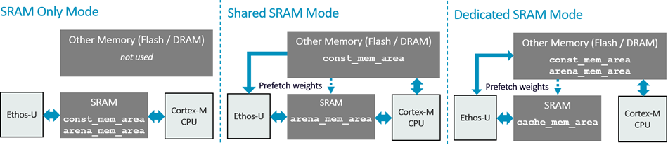

# Overview

The **Arm CMSIS Ethos-U pack** provides the low-level driver for Arm [Ethos-U55](https://www.arm.com/products/silicon-ip-cpu/ethos/ethos-u55),
  [Ethos-U65](https://www.arm.com/products/silicon-ip-cpu/ethos/ethos-u65), and
  [Ethos-U85](https://www.arm.com/products/silicon-ip-cpu/ethos/ethos-u85) neural processing units (NPUs). The driver connects an
ML inference runtime to the NPU and supports initialization, neural-network
command-stream execution, interrupt handling, and performance monitoring.

Before deployment, the [Vela compiler](https://arm-software.github.io/CMSIS-Ethos-U/main/vela/index.html)
optimizes a quantized ML model for the selected Ethos-U target. At runtime, the
Cortex-M application and ML inference runtime use this pack's driver to submit
the compiled command stream and model memory regions to the NPU.

## Memory modes

Ethos-U systems can place model constants, the tensor arena, and temporary data
in different memories. Vela uses the selected memory mode and the target's
memory-performance configuration to optimize data movement and execution.

- **SRAM-only mode** keeps both constants and the tensor arena in SRAM for low
  access latency, but the complete model and arena must fit there.
- **Shared-SRAM mode** keeps the tensor arena in SRAM while read-only constants
  reside in Flash, MRAM, or DRAM, reducing SRAM usage.
- **Dedicated-SRAM mode** places constants and the tensor arena in larger memory
  and uses SRAM as a fast staging area for selected data.

See the [General documentation](https://arm-software.github.io/CMSIS-Ethos-U/main/general/index.html)
for memory-mode concepts and the [Integration documentation](https://arm-software.github.io/CMSIS-Ethos-U/main/integration/index.html)
for linker placement, memory attributes, cache policy, and driver configuration.

## Features

- Generic core-driver components for Arm Ethos-U55, Ethos-U65, and Ethos-U85.
- Synchronous and asynchronous command-stream execution.
- Interrupt handling and performance monitoring unit (PMU) support.
- Configuration headers for each supported NPU family.
- Platform hooks for cache maintenance, address translation, locking, and
  logging.
- Guidance for Vela configuration, driver use, system integration, and Zephyr.

## Links

- [Documentation](https://arm-software.github.io/CMSIS-Ethos-U/main/index.html)
- [Zephyr](https://arm-software.github.io/CMSIS-Ethos-U/main/zephyr/index.html)
- [Repository](https://github.com/Arm-Software/CMSIS-Ethos-U)
- [Issues](https://github.com/Arm-Software/CMSIS-Ethos-U/issues)
